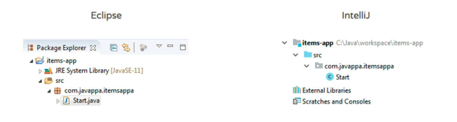
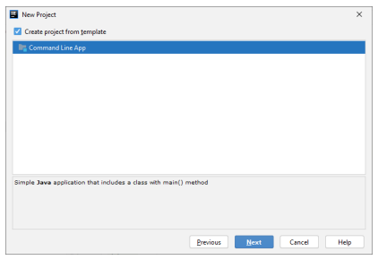
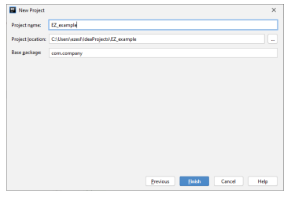

# PROGRAMOWANIE OBIEKTOWE JAVA – LABORATORIUM

Narzędzia programistyczne: **Eclipse** vs **IntelliJ**
<br>

## Pierwszy projekt 

W celu stworzenia projektu wybieramy opcję Create New Project: 
<br>

Następnie w oknie New Project konfigurujemy podstawowe ustawienia (zaznaczamy Java oraz 
wybieramy Project SDK): 
<br>
Klikamy w przycisk Next i w ten sposób przechodzimy do kolejnego widoku. Zaznaczamy opcje tak 
jak na zdjęciu: 
<br>
W tym momencie musimy jeszcze ustawić nazwę naszego projektu oraz jego lokalizację na dysku i 
możemy zakończyć cały proces przyciskiem Finish: 
<br>

## Uruchomienie programu 
Naszym oczom powinien się ukazać widok główny IDE. Do tej pory zdjęcia wszystkich okien 
wstawialiśmy w ciemnym schemacie kolorystycznym. Teraz dla odmiany użyjemy jasnego motywu: 
<br>

## Wprowadzenie do Javy 
Słowa kluczowe (Keywords): 

• **package** - Określa pakiet, a więc grupę klas i interfejsów o zbliżonym zakresie działania. Pakiet 
widziany z poziomu systemu operacyjnego to nic innego jak folder, a klasy i interfejsy są
definiowane w plikach. Najczęściej zarówno klasa, jak i interfejs są tworzone w osobnych 
dedykowanych plikach (bywa, że w jednym pliku możemy mieć kilka klas i interfejsów, ale to 
nie jest istotne na tym etapie). 

• **class** - Klasa definiuje cechy i zachowania, które przyjmie obiekt stworzony na bazie takiej 
klasy. Zachowania to działania, jakie obiekt może wykonać. Najczęściej są to funkcje (w Javie 
mówimy metody). Natomiast cechy obiektu są przechowywane w polach klasy (fields). 
• **interface** - Interfejs definiuje zachowania, które przyjmie obiekt stworzony na bazie takiego 
interfejsu. W przypadku interfejsu inaczej niż w przypadku klas, metody najczęściej nie 
zawierają kodu wykonującego określone zadanie (zdarzają się wyjątki, ale o tym nie teraz). 
Metody te są projektem, a więc tworzymy tylko ich deklaracje, a to klasy później dostarczą
wykonanie tego projektu. 
• **import** Używane na początku pliku z kodem. Wskazuje lokalizacje zewnętrznych pakietów i 
klas, których później możemy użyć w naszym kodzie. 
• **extends** - Umożliwia rozszerzanie klas i interfejsów przez podklasy i podinterfejsy. 
• **implements** - Umożliwia implementowanie interfejsów przez klasy. 

## Java podstawy 
```
public class Start {
  public static void main(String[] args) {
     System.out.println("Hello!");
 }
}
```

Pierwsze co rzuca nam się w oczy to słowa kluczowe, takie jak *public*, *class*, *static*, *void*.
Następnie widzimy, że kod posiada wydzielone bloki. Jeden z nich określa blok całej klasy, a drugi - 
zawierający się w tej klasie - blok metody. Możemy więc powiedzieć, że nasz pierwszy program zawiera 
instrukcje blokową, w której zawiera się inna instrukcja blokowa, w której definiujemy instrukcję w 
postaci wyrażenia (wywołującego metodę drukującą na konsoli tekst `Hello!`). 
```
package com.company;
public class Main {
 public static void main(String[] args) {
   // write your code here 
   System.out.println("Hello Java");
 }
}
```

Linia pierwsza `public class` Start pozwala nam zdefiniować klasę: 
• Słowo *public* to tzw. modyfikator dostępu. Określa on widoczność elementu, przed którym 
jest wpisany - czyli w tym przypadku klasy. Najprościej mówiąc, public oznacza, iż do danej 
klasy można dostać się z każdego miejsca programu (każdego innego kawałka kodu, 
zlokalizowanego nawet w innym pliku, w innym pakiecie). 

• Słowo *class* możemy opisać, jako szablon do tworzenia nowych obiektów, o określonych 
cechach (tzw. pola), oraz zachowaniach (tzw. metody). Obiekt utworzony na podstawie danej 
klasy nazywany jest jej instancją, a proces jego tworzenia - instancjonowaniem. 

• Słowo *Main* oznacza nazwę klasy. 

Druga linia `public static void main(String[] args)` pozwala nam zdefiniować metodę. 
Metoda to fragment kodu programu - pewien ciąg instrukcji, który realizuje określoną funkcję - 
potocznie mówiąc, realizuje pewne zadania. 

• Słowo *public* omówiliśmy już wyżej. Modyfikator w tym wypadku co prawda odnosi się
do metody, ale podlega tym samym zasadom dostępności jak w przypadku klasy. 

• Słowo *static* mówi nam, że metoda jest statyczna. Metody statyczne różnią się od 
zwykłych metod tym, że do ich wywołania nie potrzebujemy instancji klasy. Taką metodę
możemy wywołać bezpośrednio, odwołując się do klasy. 

• Słowo *void* mówi nam jaki typ jest zwracany przez metodę. Konkretne słowo void oznacza, 
że metoda niczego nie zwraca (żadnej instancji obiektu lub wartości, na przykład liczbowej). 

• Słowo main oznacza nazwę metody. Publiczna metoda statyczna o nazwie main z dokładnie 
tak określonymi parametrami *(String[] args)* jest zarezerwowana dla metody uruchamiającej 
program. 

• Określenie *(String[] args)* oznacza parametr metody. W tym dokładnie przypadku jest 
to zbiór argumentów. String to nazwa klasy, jakiej używamy do reprezentacji ciągu znaków, 
natomiast args oznacza po prostu nazwę parametru. Zagadkowy znak [] oznacza tablicę. 
Bardziej szczegółowo temat tablic omówimy na dalszym etapie kursu. Na tym etapie warto 
podkreślić, że wszystkie argumenty, jakie chcemy przekazać do programu z zewnątrz, są
przekazywane właśnie tą drogą. 

Trzecia linia `System.out.println("Hello Java")` jest odpowiedzialna za wyświetlenie na 
ekranie ciągu znaków, jakim jest "Hello Java". 
• Słowo *System* samo w sobie oznacza nazwę klasy. 

• Słowo *out* oznacza pole klasy System. 

• Słowo *println* oznacza nazwę metody, zdefiniowanej w klasie System, która jest 
odpowiedzialna za wyświetlanie danych na ekranie (a dokładniej na konsoli). 

• Określenie `Hello Java` to ciąg znaków, jaki chcemy wyświetlić na ekranie. 

## Uruchomienie programu

Program można uruchomić poprzez zakładkę Run -> Run Main (Shift+F10) (1) lub klikając na zieloną
strzałkę po w prawym górnym rogu projektu (2). 
<br>

## Typy proste 
Java jest językiem silnie ukierunkowanym na programowanie obiektowe, ale zawiera również typy 
proste. Typy proste mogą być używane zarówno w polach klas jak i jako zwykłe zmienne w metodach. 
Do typów prostych należą: `char`, `boolean`, `byte`, `short`, `int`, `long`, `float` oraz 
`double`. 

### Przykład: 
```
package com.company;
public class Main {
 public static void main(String[] args) {
   // write your code here 
   System.out.println("Hello Java");
   char itemFirstCharacter = 'i';
   System.out.println(itemFirstCharacter);
   boolean enabled = true;
   System.out.println(enabled);
   byte itemsNumberByte = 7;
   System.out.println(itemsNumberByte);
   short itemsNumberShort = 400;
   System.out.println(itemsNumberShort);
   int itemsNumberInt = 53000;
   System.out.println(itemsNumberInt);
   long itemsNumberLong = 72036854775807l;
   System.out.println(itemsNumberLong);
   float itemsNumberFloat = 4.33f;
   System.out.println(itemsNumberFloat);
   double itemsNumberDouble = 4.99;
   System.out.println(itemsNumberDouble);
 }
}
```
### Instrukcje wyświetlania danych 
```
 public static void main(String[] args) {
   // deklaracja zmiennych 
   String imie;
   int wiek;
   double pensja;
   String miasto;
   // inicjalizacja zmiennych 
   imie = "Jurek";
   wiek = 22;
   System.out.println("Imię "+imie);
   System.out.println("Wiek "+wiek);
   System.out.println("Miasto "+miasto);
}
```
### Instrukcje wczytywania danych z klawiatury 
```
public class Main {
 public static void main(String[] args) {
   /*Przykład wczytywania i wyświetlania liczb(danych) */
   // Stworzenie obiektu klasy Scanner z parametrem System.in 
   // Ten obiekt posłuży do wczytywania liczb (danych) 
   Scanner in = new Scanner(System.in);
   // Przed wczytywanie danych należy poinformować użytkownika, 
   // co konkretnie ma wykonać: 
   System.out.println("Podaj liczbe calkowita");
   int a = in.nextInt(); // w tym przypadku metoda obiektu in 
   // (klasy Scanner) nextInt() powoduje wczytanie 
   // liczby całkowitej z klawiatury. 
   // Wyświetlenie tekstu oraz wartości wczytanej liczby: 
   System.out.println("Wczytana liczba, to: " + a);
   /* Obiekt in posiada więcej metod, których listę można zobaczyć po 
  wpisaniu: 
   * in. */
   //Dane można też wczytywać do wcześniej zadeklarowanych zmiennych: 
   System.out.println("Podaj nowa liczbe calkowita");
   a = in.nextInt();
   System.out.println("Wczytana liczba, to: " + a);
   // Oczywiście istnieje możliwość wczytania liczby rzeczywistej: 
   System.out.println("Podaj liczbe rzeczywista");
   float f = in.nextFloat();
   System.out.println("Wczytana liczba, to: " + f);
   // Metoda println powoduje wyświetlenie komunikatu i przejście do 
  nowej 
   // linii natomiast metoda print tylko wyświetla komunikat: 
   System.out.print("Komunikat 1a");
   System.out.print("Komunikat 2a");
   System.out.println(); // Nowa linia 
   System.out.println("Komunikat 1b");
   System.out.println("Komunikat 2b");
   // Przejście do nowej linii można również wymusić wstawiając znak 
  '\n' 
   System.out.print("Komunikat 1c\nKomunikat 2c\n");
   // W podobny sposób można wstawić znak tabulacji itp. 
   System.out.println("Komunikat 1d\tKomunikat 2d");
   // Dodatkowo można zastosować wyświetlanie danych podobne do 
   // znanego printf 
   // %f oznacza, że w to miejsce zostanie wstawiona liczba 
  rzeczywista 
   // %d oznacza, że w to miejsce zostanie wstawiona liczba całkowita 
   System.out.format("Podana liczba calkowita wynosi %d, natomiast "
   + "rzeczywista %f. Wynik dzielenia: %f\n", a, f, a / f);
   // W tym przypadku można wyświetlić również liczbę rzeczywistą z 
   // dokładnością do określonego miejsca po przecinku. Wystarczy 
  wtedy 
   // pomiędzy znakiem '%' a oznaczeniem 'f' dopisać kropkę '.' i 
  liczbę
   // oznaczającą dokładność. Np. %.3f oznacza, że liczba ma zostać
   // wyświetlona na 3 miejsca po przecinku. 
   System.out.format("Liczba rzeczywista %.3f. Wynik: %.2f\n", f, a /
  f);
   System.out.format("\nPI: %.4f, %.3f, %.2f, %.1f, %.0f\n",
   Math.PI, Math.PI, Math.PI, Math.PI, Math.PI);
  7 
 }
```
### Instrukcje (Statements) 
Określają konkretne działania w programie, takie jak na przykład deklarowanie i przypisywanie 
wartości lub sterowanie zachowaniem kodu. Wyróżniamy insrukcje: 

• **Deklaracyjne (Declaration Statement)** - umożliwiają zadeklarowanie zmiennej, na przykład: 
```
int itemValue;
int itemMaxValue = 10;
String textElement;
```

• **Wyrażeniowe (Expression Statement)** - elementy kodu zakończone średnikiem, na przykład: 
```
// Wyrażenie zwiększenia (inkrementacja) lub zmniejszenia (dekrementacja) 
wartości o jeden: 
itemNumber++;
++itemNumber;
itemNumber--;
--itemNumber;
 
// Wyrażenie przypisanie wartości 
itemNumber = 100;
itemNumber *= 10;
 
// Wyrażenie wywołujące metodę
System.out.println("Fragment tekstu");
someMethod(parametr1, parametr2);
```

### Operatory: 
• Arytmetyczne: + - * / %

• Operatory porównania: == != < > <= >= 

• Logiczne: && || !

Przykład: 
```
package com.company;
public class Main {
 public static void main(String[] args) {
   // write your code here 
   System.out.println("Hello Java");
   int itemValue = 100 + 50;
   System.out.println(itemValue);
   int itemCurrentValue = itemValue + 250;
   System.out.println(itemCurrentValue);
   int itemNextValue = itemCurrentValue + itemValue;
   System.out.println(itemNextValue);
   // Przypisanie nowej wartości do zmiennej 
   itemValue = 10;
   System.out.println(itemValue);
  8 
   // Dodanie nowej wartości do zmiennej 
   // i przypisanie wyniku do tej samej zmiennej 
   itemValue += 5;
   System.out.println(itemValue);
   // Pomnożenie wartości zmiennej 
   // i przypisanie wyniku do tej samej zmiennej 
   itemValue *= 3;
   System.out.println(itemValue);
   if (itemValue >= 10) {
   System.out.println("Zmienna jest większa od 10.");
   }
 }
}
```
### Instrukcje warunkowe: 
```
package com.company;
public class Main {
 public static void main(String[] args) {
   // write your code here 
   System.out.println("Hello Java");
   int numberOfItems = 220;
   if (numberOfItems < 100) {
     System.out.println("Liczba itemów mniejsza niż 100.");
   } else if (numberOfItems < 200) {
   System.out.println("Liczba itemów mniejsza niż 200.");
   } else {
     System.out.println("Liczba itemów nie jest mniejsza od 100 ani 
  od 200. Jest większa bądź równa 200.");
   }
 }
}
```
### Instrukcja wyboru Switch 
```
package com.company;
public class Main {
 public static void main(String[] args) {
   // write your code here 
   System.out.println("Hello Java");
   int numberOfItems = 50;
   switch (numberOfItems) {
   case 0:
     System.out.println("Liczba itemów równa jest 0.");
     break;
   case 10:
     System.out.println("Liczba itemów równa jest 10.");
     break;
   case 50:
     System.out.println("Liczba itemów równa jest 50.");
     break;
   case 103:
     System.out.println("Liczba itemów równa jest 103.");
     break;
   default:
     System.out.println("Liczba itemów jest inna niż
    przewidywana");
   }
 }
}
```

## Zadania: 
### **[Zadanie 1.](https://github.com/dawidolko/Programming-Java/blob/master/Example/Lab1/zadania/src/zadanie1.java)** 
Napisz metodę, która zwróci twoje imię oraz aktualny wiek. 
### **[Zadanie 2.](https://github.com/dawidolko/Programming-Java/blob/master/Example/Lab1/zadania/src/zadanie2.java)
Napisz metodę, która jako argument przyjmuje 2 liczby i wypisuje ich sumę, różnicę i iloczyn. 
Argumenty przekazywane do metody są liczbami wprowadzanymi przez użytkownika z klawiatury. 
### **[Zadanie 3.](https://github.com/dawidolko/Programming-Java/blob/master/Example/Lab1/zadania/src/zadanie3.java)
Napisz metodę, która jako argument przyjmuje liczbę i zwraca true jeśli liczba jest parzysta. 
### **[Zadanie 4.](https://github.com/dawidolko/Programming-Java/blob/master/Example/Lab1/zadania/src/zadanie4.java)
Napisz metodę, która jako argument przyjmuje liczbę i zwraca true jeśli liczba jest podzielna przez 
3 i przez 5. 
### **[Zadanie 5.](https://github.com/dawidolko/Programming-Java/blob/master/Example/Lab1/zadania/src/zadanie5.java)
Napisz metodę, która jako argument przyjmuje liczbę i zwraca go podniesionego do 3 potęgi. 
### **[Zadanie 6.](https://github.com/dawidolko/Programming-Java/blob/master/Example/Lab1/zadania/src/zadanie6.java)
Napisz metodę, która jako argument przyjmuje liczbę i zwraca jej pierwiastek kwadratowy. 
### **[Zadanie 7.](https://github.com/dawidolko/Programming-Java/blob/master/Example/Lab1/zadania/src/zadanie7.java)
Napisz metodę, która jako argument przyjmie trzy liczby. Metoda powinna zwrócić true jeśli 
z odcinków o długości przekazanych w argumentach można zbudować trójkąt prostokątny. 
Argumenty przekazywane do metody są liczbami losowymi z przedziału `<a,b>` a i b wczytywane są
przez użytkownika z klawiatury.
