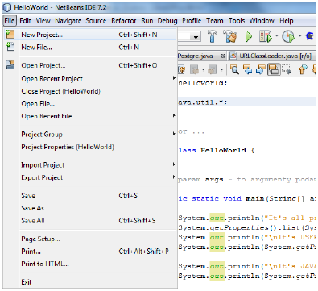
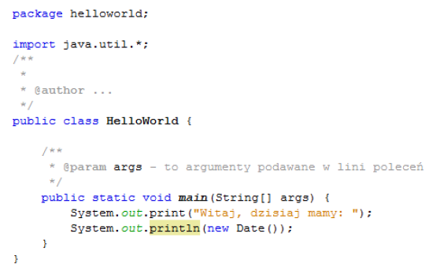
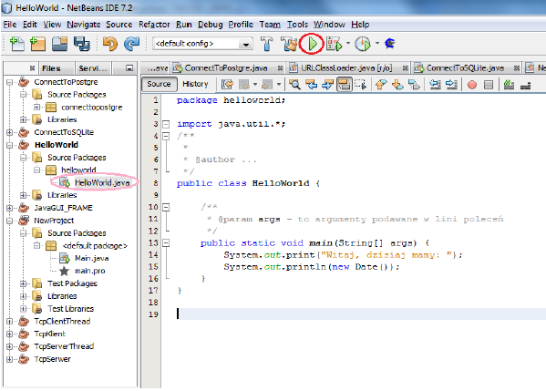
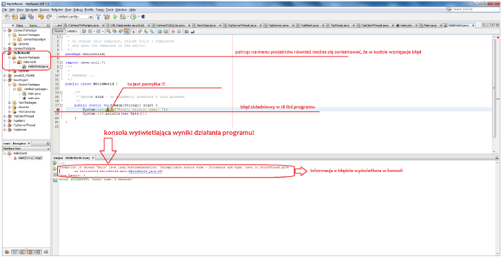

# **Lab00 - Praca w środowisku NetBeans**

### **UWAGA:** 
`Do niniejszego laboratorium należy przygotować sprawozdanie z wyników pracy dla
poszczególnych zadań. Należy też dodać kody programów w formie tekstowej.`

## **Zadanie 1:**
Uruchom środowisko NetBeans a następnie:

A) Utwórz nowy projekt i nadaj mu nazwę `HelloWorld` lub względnie `HelloWorld` z indeksem
liczbowym np. HelloWorld1 jeśli istnieje już projekt o nazwie „HelloWorld”.
 
 

B) Wprowadź do projektu następujący kod programu w języku JAVA:

 

Podczas wprowadzania kodu do projektu należy zwrócić uwagę gdzie wpisuje się kod aby nie nie
wprowadzić go mylnie do innego projektu, utworzonego wcześniej w środowisku. Właściwe
miejsce wprowadzanie kodu w menu projektów (z lewej strony) zaznaczono kolorem różowym na
rysunku poniżej. Po wprowadzeniu kodu programu należy dokonać jego kompilacji naciskając
zielony trójkącik (zaznaczony na poniższym rysunku czerwonym kółkiem).

 

Jeśli kod zostanie wprowadzony poprawnie, kompilator uruchomi go i konsoli wyświetli się wynik
działania programu. W przeciwnym razie w konsoli pojawi się informacja o błędzie w kodzie.
Na rysunku poniżej pokazano przypadek gdy nastąpiła pomyłka podczas wprowadzania kodu –
kompilator informuje, w której linii występuje błąd składniowy.

 

Java jest językiem silnie typowanym i pokazuje błędy składniowe już w trakcie edycji kodu.

C) Proszę wyświetlić wyniki poprawnie zredagowanego programu i umieścić je w sprawozdaniu
wraz z krótkim omówieniem.

## **Zadanie 2:**
Utwórz nowy projekt o nazwie „SystemProperties”. W metodzie „main” umieść poniższy kod.
Uruchom program i wyświetl wyniki. Wyświetlone na konsoli wyniki umieść w sprawozdaniu wraz
z krótkim omówieniem.

 

## **Zadanie 3.**
Utwórz projekt o nazwie DeklaracjaWlasna. W metodzie „main” umieść poniższy kod. Uruchom
program i wyświetl wyniki. Wyświetlone na konsoli wyniki umieść w sprawozdaniu wraz z
własnym odniesieniem się do treści deklaracji własnej.

 
