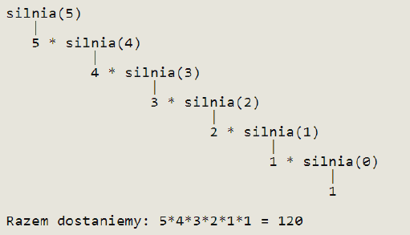

# **Lab02 - Operatory, rekurencja, typ łańcuchowy w języku Java**

## [1.] Operatory

### **Zadanie 1.1** 
Co zwróci poniższy program. Uzasadnij odpowiedź.
```
public class IncDec{
  public static void main(String[] arg){
    double a=12.12;
    System.out.println(a--);
    System.out.println(a++);
    System.out.println(--a);
    System.out.println(++a);
  }
}
```

### **Zadanie 1.2** 

Napisz program demonstrujący działanie operatorów logicznych koniunkcji `&&` i
alternatywy `||`. Użyj w tym celu konstrukcji warunkowej `if`.
Zadanie 2.2 Czym różnią się operatory
- && od &
- || od |
Napisz programy pokazujące różnice w ich działaniu.

### **Zadanie 1.3** 

Przestudiuj następujący artykuł: [LINK](http://jlaskowski.blogspot.com/2012/01/ooperatorach-przesuniec-w-javieprawie.html)
Następnie napisz programy demonstrujące działanie operatorów:
- w lewo ze znakiem `<<`
- w prawo ze znakiem `>>`
- w prawo bez znaku `>>>`

### **Zadanie 1.4** 

Dany jest fragment kodu:
```
int a = 17;
double b = 4.0;
a += b; // ?
a -= b; // ?
a *= b; // ?
a /= b; // ?
a %= b; // ?
```

Jakie działania arytmetyczne reprezentują wyrażenia w kodzie i jakie wyniki zwrócą?

### **Zadanie 1.5**

Dany jest fragment kodu:
```
int a = 5;
int b = 3;
int c = a+b++;
int d =(a++)+b;
```

W jakiej kolejności będą wykonywana działania podczas wyliczania wartości zmiennych c i d? Jakie
wartości zostaną wyliczone?

### **Zadanie 1.6**
Jakimi operatorami w Javie definiuje się operacje logiczne `NOT` i `XOR`. Utwórz
odpowiednie programy demonstrujące działanie dla tych bramek logicznych.

### **Zadanie 2.7**
Utwórz program wykorzystujący działanie operatora przeciwnego do operatora
porównania `==`.

## [2.] Typ łańcuchowy

### **Zadanie 2.1**

Zapoznaj się z dokumkentacją klasy `String`:
[LINK](http://docs.oracle.com/javase/6/docs/api/java/lang/String.html)
Przetestuj działanie poniższego programu
```
public class StringExample
{
  public static void main( String args[] )
{
  String s1 = new String( "Happy " );
  String s2 = new String( "Birthday" );
  System.out.printf( "s1 = %s\ns2 = %s\n\n",s1, s2 );
  System.out.printf(
  "Result of s1.concat( s2 ) = %s\n", s1.concat( s2 ) );
  System.out.printf( "s1 after concatenation = %s\n", s1 );
  } // end main
}
```
### **Zadanie 2.2** 
Opisz słownie działanie następujących metod klasy String oraz utwórz proste aplikacje
w języku Java pokazujące zasadę działania tych metod – jako wzór patrz program powyżej. Wyniki
działania wypisz na konsoli.

- `char[] toCharArray()`
- `byte[] getBytes()`
- `boolean equals(String str)`
- `boolean equalsIgnoreCase(String str)`
- `int campareTo(String str)`
- `int campareToIgnoreCase(String str)`
- `int indexOf(int i)`
- `int indexOf(String str)`
- `int lastIndexOf(int i)`
- `int lastIndexOf(String str)`
- `String substring(int startString)`
- `String substring(int startString, int stopString)`
- `String replace(char orginal, char zamiennik)`
- `String trim()`
- `String toLowerCase()`
- `String toUpperCase()`
- `String[] split(String regex, int limit)`
- `String[] split(String regex)`

## [3.] Rekursja (rekurencja)

### **Zadanie 3.1.**
Przetestuj działanie poniższego programu
```
import java.util.*;
public class Silnia {
  // metoda silnia zwraca silnię z liczby przekazanej jako parametr
  // obliczenie silni odbywa się za pomocą rekurencji
  public static int silnia(int wartosc) {
    // jeśli przekazany parametr jest równy zero to zwróć 1
    // a w przeciwnym wypadku zwróć wartość parametru * wywołanie metody silnia
    // z parametrem o jeden mniejszym
    if(wartosc == 0) return 1;
      else return wartosc * silnia(wartosc - 1);
    }
  public static void main(String[] args){
    Scanner sc = new Scanner(System.in);
    System.out.print("Podaj liczbę: " );
    // pobieramy od użytkownika liczbę
    int liczba = sc.nextInt();
    // wyświetlamy na ekranie obliczoną silnię
    System.out.println(liczba + "! = " + silnia(liczba));
  }
}
```
Po uruchomieniu aplikacji:

<br>

**Analiza działania:**
Podając na wejściu liczbę 5 wywołamy metodę silnia z wartością pięć. Metoda zwróci nam wartość
parametru pomnożoną ponowne wywołanie metody silnia z parametrem o 1 mniejszym itd.
Przebieg działania metody będzie wyglądał tak jak poniżej:

<br>


### **Zadanie 3.2.**
Utwórz program obliczający silnie bez użycia rekurencji. Do wykonania działania
użyj dowolnej pętli.

### **Zadanie 3.3.**
Zaimplementuj algorytm potęgowania w dwu wersjach: rekurencyjnej i iteracyjnej
(dwie osobne metody – funkcje). W celu wykonania zadania zapoznaj się z następującym
materiałem: [LINK](http://pl.wikipedia.org/wiki/Algorytm_szybkiego_pot%C4%99gowania)

### **Zadanie 3.4.**
Zaimplementuj algorytm obliczający wartość ciągu Fibonacciego. W celu wykonania
zadania zapoznaj się z następującym materiałem:
[LINK](http://pl.wikipedia.org/wiki/Ci%C4%85g_Fibonacciego)

### **Zadanie 3.5** `(fakultatywne)`.
Napisz algorytm realizujący zagadnienie wież Hanoi.
W celu wykonania zadania zapoznaj się z następującym materiałem:
[LINK](http://pl.wikipedia.org/wiki/Wie%C5%BCe_Hanoi)
