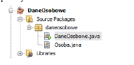
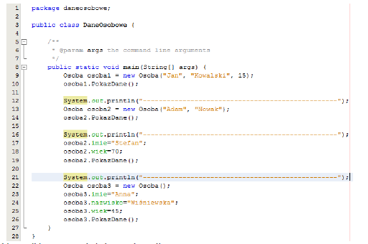

# Lab04 - Tworzenie klas i obiektów w języku Java

## **Zadanie 1.**
Utwórz projekt o nazwie DaneOsobowe zawierający dwie klasy: DaneOsobowe i Osoba zob. rys.
poniżej.

 

Uzupełnij klasy następującym kodem:
**Osoba:**

 

**Dane osobowe:**

 

Jakie wyniki zostaną wyświetlone na konsoli.

**Ważne (przeczytać !!!):**

- Konstruktory służą do tworzenia obiektów. W języku Java konstruktor posiada
następujące cechy: jego nazwa jest identyczna z nazwą klasy, w której się znajduje; może
posiadać parametry, którymi najczęściej ustawia wartości pól w klasie; w odróżnieniu od
metod nie zwraca żadnej wartości. Jeśli programista nie zdefiniuje, żadnego konstruktora
wewnątrz klasy, kompilator utworzy w trakcie kompilacji konstruktor domniemany dla tej
klasy. Będzie on ekwiwalentem konstruktora pustego, z tą różnicą, że nie będzie on
obecny w kodzie programu. Java tworzy konstruktory domyślne tylko w przypadku braku
jakiegokolwiek konstruktora w kodzie klasy.
- Konstruktory i metody w języku Java podlegają mechanizmowi przeciążenia (ang.
overload). Oznacza to, że mogą występować w różnych wersjach (pod różnymi
postaciami). Metody przeciążane cechują się tą samą nazwą. Różnić się natomiast mogą
ilością argumentów, typem argumentów, typem zwracanym i wnętrzem metody (kodem
programu wewnątrz metody). Podobnie jest z konstruktorami, przy czym te z definicji
mają tę samą nazwę, i dodatkowo w przeciwieństwie do metod nie zwracają wartości. Jeśli
zatem konstruktory nie zwracają wartości, nie można ich przeciążać po zwracanym typie.
Solidarnie do nich również i metody nie mogą być przeciążane po zwracanym typie, co
jednak nie oznacza, że wszystkie one muszą mieć ten sam typ zwracany. Konkludując,
można stwierdzić, że wariantywność przeciążanych metod objawia się poprzez różnice w
ilości i typie argumentów przyjmowanych przez metodę czy konstruktor. Mechanizm
przeciążania należy do zjawisk polimorfizmu w językach programowania.

## **Zadanie 2.** 
Na podstawie zadania 1, utwórz aplikacją zawierającą klasę `Student`, która posiada
następujące pola: `imię`, `nazwisko`, `nr_indeksu`, `nazwa specjalności`, `rok_studiow`. Dla pól dobierz
odpowiedni typ danych. Utwórz cztery przeciążenia konstruktorów dla tej klasy (każda wersja
konstruktora powinna przyjmować przynajmniej jeden parametr - nie tworzyć konstruktora
pustego). Utwórz metodę wyświetlającą dane o studencie. Utwórz cztery obiekty klasy `student`,
każdy korzystający z innego przeciążenia konstruktora podczas tworzenia obiektu. Dla każdego
obiektu uruchom metodę wyświetlającą dane.

## **Zadanie 3.**
Utwórz, która umożliwia wprowadzanie danych studenta z konsoli. Użyj do tego celu
znanego już obiektu `Scanner` oraz klasy `Student` z zadania 2.

## **Zadanie 4.**
Utwórz projekt `ObliczanieFigur`. Do projektu dodaj klasy opisujące następujące figury
geometryczne: `Koło`, `Kwadrat`, `Prostokąt`, `Sześcian`, `Prostopadłościan`, `Kula`, `Stożek`. Dla każdej
klasy dobierz odpowiednie pola. Utwórz także metody obliczające pola figur, obwody (dla figur
płaskich), oraz objętości (dla figur przestrzennych). Dla każdej klasy utwórz metodę wyświetlającą
dane dotyczące figury tj. nazwa, parametry, wartość pola i obwodu lub objętości. Utwórz obiekty
tych figur i pokaż wyniki obliczeń przy użyciu funkcji wyświetlającej dane.

***Utwórz kalkulator dla figur geometrycznych tj. odpowiednie menu pozwalające na: wybór1 figury
geometrycznej oraz wprowadzanie parametrów dla tej figury z konsoli. Następnie wyświetl wyniki
przy użyciu metody wyświetlającej dane.**

## **Zadanie 5.**
Utwórz projekt WprowadzDane zawierający 100 elementową tablicę klasy `Student`
(użyj klasy Student z zadania 2). Utwórz metodę tworzącą obiekt dla każdego elementu tablicy i
ustawiającą domyślne wartości dla niego tj. dla typu liczbowego: 0, dla typu łańcuchowego: łańcuch
pusty ` `.
Utwórz metody umożliwiające:
- wprowadzanie danych studenta pod wybrany index tablicy,
- edycję (nadpisanie danych studenta) spod wybranego indeksu,
- usunięcie danych studenta (tj. nadpisanie elementów tablicy wartościami domyślnymi),
- wyświetlenie obiektu o danym indeksie.
- wyświetlenie wszystkich obiektów,
- wyświetlenie zakresu obiektów w podanym zakresie.

***Nieobligatoryjne (fakultatywne) zadania lun elementy zadań.**
