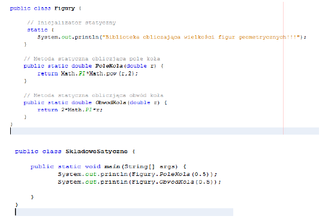
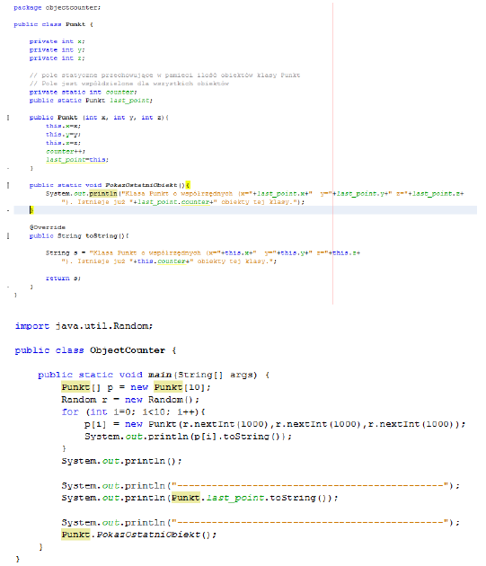

# Lab06 - Składowe statyczne klasy w języku Java

## **Zadanie 0.** `Krótkie wprowadzenie`

Składowe klasy mogą być `statyczne` i `niestatyczne`.
Niestatyczne zawsze wiążą się z istnieniem jakiegoś obiektu (pola - odpowiadają elementom
obiektu, metody muszą być wywoływane na rzecz obiektu, są komunikatami do obiektu)
Składowe statyczne (pola i metody) są wspólne dla wszystkich obiektów i:

- są deklarowane przy użyciu specyfikatora static,
- mogą być używane nawet wtedy, gdy nie istnieje żaden obiekt klasy

**Uwaga:** ze statycznych metod nie wolno odwoływać się do niestatycznych składowych klasy
(obiekt może nie istnieć). Możliwe są natomiast odwołania do innych statycznych składowych.
Spoza klasy do jej statycznych składowych możemy odwoływać się na dwa sposoby:

- `NazwaKlasy.NazwaSkładowej`

- gdy istnieje jakiś obiekt: tak samo jak do niestatycznych składowych (uwaga: jest to
mylące i nie polecane).

## **Zadanie 1.**

Utwórz klasę `Figury`. Umieść w niej poniższy kod i przetestuj działania. Zauważ, że metody
statyczne `PoleKola` i `ObwodKola` korzystają z innych metod statycznych zawartych w bibliotece
Math, która również jest klasą. Dodaj wewnątrz klasy kolejne metody statyczne umożliwiające
obliczanie następujących figur: `kwadrat`, `prostokąt`, `stożek`, `walec`.

 

## **Zadanie 2.**

Przetestuj i opisz działanie poniższego kodu źródłowego.

 

## **Zadanie 3.**

Utwórz klasę `Complex` implementującą strukturę liczb zespolonych. Do klasy dodaj metody
statyczne dokonujące obliczeń na tych liczbach tj:

- obliczanie modułu liczby zespolonej,
- obliczenie wartości liczby sprzężonej do liczby zespolonej,
- zamiana postaci algebraicznej liczby zespolonej na wykładniczą,
- zamiana postaci wykładniczej liczby zespolonej na algebraiczną,
- dodawanie (z argumentami w postaci algebraicznej),
- dodawanie (z argumentami w postaci wykładnicze),
- odejmowanie (z argumentami w postaci algebraicznej),
- mnożenie (z argumentami w postaci algebraicznej),
- dzielenie (z argumentami w postaci algebraicznej),
- dzielenie (z argumentami w postaci wykładniczej),

Oraz metody zwracającą wartość liczby zespolonej w typie łańcuchowym (String) w postaci zapisu:
- algebraicznego,
- wykładniczego,
- trygonometrycznego.
