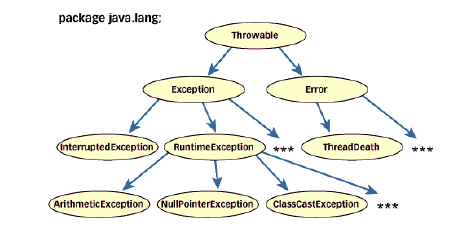

# Lab11 - Obsługa i rzucanie wyjątków w języku Java

Wyjątki to sytuacje nienormalne, pojawiające się w trakcie wykonywania programu. Języki nie
posiadające mechanizmu obsługi wyjątków wymagają aby błędy były wykrywane i obsługiwane
ręcznie - najczęściej przez kody błędów. Język Java dostarcza specjalnych konstrukcji do
wykrywania i obsługi takich sytuacji. Wyjątek jest w Javie obiektem opisującym sytuację
wyjątkową (błędną), która powstała w kodzie programu.
Gdy w danej metodzie wystąpi błąd, zostaje wyrzucony wyjątek opisujący ten błąd. Metoda może
wyłapać i obsłużyć wyjątek samodzielnie albo przekazać go dalej. Na koniec błąd jest wyłapywany
i obsługiwany.

Do obsługi wyjątków w języku Java wykorzystujemy następujące słowa kluczowe:

`try` - blok instrukcji, które są monitorowane na wypadek błędu.
`catch` - występuje w parze z try. Wyłapuje określone wyjątki i obsługuje je w określony sposób,
`throw` - sygnalizuje wystąpienie określonego wyjątku,
`throws` - określa jakie wyjątki może zgłaszać dana metoda,
`finally` - blok instrukcji, który musi zostanie wykonany obojętnie czy w bloku try wystąpił
wyjątek czy nie.

Poniżej pokazano blok instrukcji `try/catch/finally` do obsługi trzech typów wyjątków:
```
try {
  //blok instrukcji monitorowanych na wypadek wystąpienia błędów
  } catch(WyjątekTypuPierwszego e) {
  //obsluga wyjatku pierwszego typu
  } catch(WyjątekTypuDrugiego e) {
  //obsluga wyjatku drugiego typu
  } catch(WyjątekTypuTrzeciego e) {
  //obsluga wyjatku trzeciego typu
  } finally {
  //kod, który musi być wykonany przed zakończeniem metody
}
```

Hierarchia wyjątków:

<br>

`Throwable` – klasa obejmująca wszystkie wyjątki,
`Exception` – wyjątki możliwe do wyłapania przez programy użytkowe,
`Error` – wyjątki niemożliwie do wyłapania przez programy użytkowe, błędy środowiska
wykonawczego.

Domyślna Obsługa Wyjątków:

Kiedy system wykryje operację dzielenia przez zero utworzy nowy obiekt będący wyjątkiem.
Ponieważ wyjątek nie ma własnej procedury obsługi zostaje przechwycony przez domyślną
procedurę. Procedura domyślna wyświetli stos wywołań (ciąg wywołań metod, które prowadziły do
wystąpienia błędu) i spowoduje zakończenie programu.
```
class WyjatekDzielenia {
  static dzielenie(int dzielna, int dzielnik) {
    int wynik = dzielna / dzielnik;
  }
  public static void main(String args[]) {
    WyjatekDzielenia.dzielenie(1024,0);
  }
}
```

Własna Obsługa Wyjątków:

Własna obsługa błędów daje możliwość poprawienia błędów oraz zapobiega przedwczesnemu
zakończeniu się programu.
```
class WlasnyWyjatek {
  public static void main(String args[]) {
    int dzielna, dzielnik, wynik;
    try {
      dzielna = 128;
      dzielnik = 0;
      wynik = dzielna / dzielnik;
      System.out.println("Niemożliwe !!!");
    }
    catch (ArithmeticException e)
    // Okreslamy wyjatki, ktore chcemy wylapac
    {
    System.out.println("Dzielenie przez 0");
    // Okreslamy jak chcemy je obsluzyc
    }
    System.out.println("Po wyjatku");
    // Kod po obsludze wyjatku
  }
}
```
Kolejność obsługi wyjątków jest ważna
Przy tworzeniu wielu sekwencji catch, wyjątki podklasy muszą występować przed wyjątkami
nadklasy. W związku z tym poniższy kod jest niepoprawny - *popraw go !*
```
class WyjatekPodKlasy {
  public static void main(String args[]) {
    try {
      int operacjaDzielenia = 224 / 0;
    }
    catch(Exception e) {
    System.out.println("Wyjatek generyczny");
    }
    catch(ArithmeticException e) {
    System.out.println("Nieosiagalny");
    }
  }
}
```

Wyświetlanie opisu wyjątku:
Klasa Throwable przesłania metodę toString() aby wyświetlała opis wyjątku.
```
try {
  int x=10/0;
  }
  catch (ArithmeticException e) {
  System.out.println("Wyjatek: " + e);
  ...
}
```

Przechwycenie dowolnego wyjątku:
- Obsługa wyjątku klasy bazowej - `Exception`
- Przydatne metody klasy Throwable - np. `String getMessage()`
- 
Przykład:
```
catch(Exception w) {
  System.out.print("Wyjątek: ");
  System.out.println(w.getMessage());
}
```
Procedura obsługi przechwytywania dowolnego wyjątku powinna się znaleźć na końcu (po
wykonaniu pozostałych).
Wyrzucanie wyjątków
Program może sam wyrzucać wyjątki: `throw Object;`
Obiekt taki musi być klasy `Throwable`, albo którejś z jej podklas.
Obiekt klasy `Throwable` uzyskać można poprzez użycie operatora new lub użycie parametru w
instrukcji `catch`.
Obsługa `throw`
Program zostaje przerywany na instrukcji `throw`. Sprawdza czy najbliższy otaczający go blok `try`
posiada instrukcję catch obsługującą dany wyjątek. Jeśli nie posiada, sprawdza czy kolejny
otaczający blok `try` posiada tą instrukcję. Jeśli nigdzie nie ma obsługi wyjątku następuje przerwanie
wykonywania programu i wydrukowanie stosu wywołań.
```
class ThrowDemo {
  static void metoda() {
    try {
```
Tworzy nowy wyjątek a następnie wyrzuca go:
```
throw new NullPointerException("demo");
```
Wyjątek zostaje natychmiast wyłapany:
```
} catch(NullPointerException e) {
  System.out.println("Zlapany w metodzie");
  Obsługa polega na przesłaniu wyjątku dalej:
  throw e;
  }
}
```
Wyjątek zostaje ponownie wyłapany przez metodę main:
```
public static void main(String args[]) {
  try {
    metoda();
   } catch(NullPointerException e) {
    System.out.println("Zlapany ponownie");
    }
  }
}
```

Tworzenie obiektu standardowej klasy wyjątku:
```
throw new NullPointerException("demo");
```
Wszystkie standardowe wyjątki mają dwa konstruktory:
- bezparametrowy
- z parametrem String opisującym wyjątek; dostępny przez `getMessage()` w Throwable.

Jeśli metoda może spowodować wyjątek którego sama nie jest w stanie obsłużyć, to musi ten fakt
opisać.
```
typ nazwa(parametry) throws wyjatki { ... }
```
Niezbędne jest wymienienie wszystkich wyjątków, oprócz typów `Error` i
`RuntimeException`.
```
class ThrowsDemo1 {
  static void metoda() {
    System.out.println("Wewnatrz metody");
    throw new IllegalAccessException("demo");
    }
    public static void main(String args[]) {
      metoda();
    }
}
```
Metoda w powyższej klasie wyrzuca wyjątek którego ani nie wyłapuje, ani nie deklaruje. Program
się nie skompiluje.
```
class ThrowsDemo2 {
  static void metoda()
    throws IllegalAccessException {
    System.out.println("Wewnatrz metody");
    throw new IllegalAccessException("demo");
}
public static void main(String args[]) {
  try {
    metoda();
  }
    catch (IllegalAccessException e) {
    System.out.println("Zlapany " + e);
    }
  }
}
```
Jedna metoda deklaruje, druga wyłapuje wyjątek.
Demonstacja finally
```
class FinallyDemo {
  static void procA() {
    try {
      System.out.println("wewnatrz procA");
      throw new RuntimeException("demo");
    }
    finally {
      System.out.println("procA: finally");
    }
}

static void procB() {
  try {
    System.out.println("wewnatrz procB");
    return;
  } finally {
    System.out.println("procB: finally");
  }
}
static void procC() {
  try {
    System.out.println("wewnatrz procC");
    }
    finally {
      System.out.println("procC: finally");
  }
}
public static void main(String args[]) {
  try {
    procA();
  }
  catch(Exception e)
  {
    System.out.println("Wyjatek zlapany");
  }
  procB();
  procC();
  }
}
```
Standardowe wyjątki niesprawdzane
`RuntimeException` są dostępne automatycznie. Nie muszą być deklarowane w sekcji `throws`.
Kompilator nie sprawdza czy metoda deklaruje czy obsługuje te wyjątki.
● `ArithmeticException` błędy arytmetyczne, np. dzielenie przez zero
● `ArrayIndexOutOfBoundsException`indeks tablicy poza zakresem
● `ArrayStoreException` przypisanie tablicy nieodpowiedniego typu elementu
● `ClassCastException` niepoprawne rzutowanie
● `IllegalArgumentException` niepoprawny argument metody
● `IllegalStateException` środowisko lub aplikacja jest w niepoprawnym stanie
● `IllegalThreadStateException` wymagana operacja niekompatybilna z bieżącym
stanem wątka
● `IndexOutOfBoundException` jakis rodzaj indeksu jest poza zakresem
● `NegativeArraySizeException` tablica tworzona z ujemnym rozmiarem
● `NullPointerException` niepoprawne użycie wskaźnika null
● `NumberFormatException` niepoprawna konwersja stringu na format liczbowy
● `SecurityException` próba naruszenia bezpieczeństwa
● `StringIndexOutOfBoundsException` indeks poza zakresem stringu
● `UnsupportedOperationException` napotkano niepoprawną operację
● `ClassNotFoundException` nie znaleziono klasy
● `CloneNotSupportedException` próba klonowania obiektu który nie implementuje
interfejsu Cloneable.
● `IllegalAccessException` dostęp do klasy zabroniony
● `InstantiationException` próba tworzenia obiektu klasy abstrakcyjnej lub interfejsu
● `InterruptedException` jeden wątek przerwany przed drugi
● `NoSuchFieldException` pole nie istnieje
● `NoSuchMethodException` metoda nie istnieje

## **Zadania:**

### **Zadanie 1.**
Utwórz klasę `WprowadzZKonsoli`. Utwórz metodę wprowadzInt wraz z obsługą wyjątków tak aby
np. nie można było wprowadzić błędnej postaci liczby tj. „1w2”. Utwórz metody wprowadzania
innych typów danych np. `byte`, `double`, `BigDecimal`, `BigInteger`, `boolean` wraz z odpowiednią
obsługą wyjątków. Do wprowadzania danych z konsoli użyj klasy `Scanner`. Przy realizacji zadania
zob. slajd o tytule „Obsługa wyjątków + stosowanie działań naprawczych ” z wykładu.

### **Zadanie 2.**
Utwórz program, który przechowuje 10 imion w tablicy łańcuchów. Użytkownik podaje `nr indeksu`
tablicy aby wyświetlić imię, które się w nim znajduje. Jeśli wykroczy poza zakres tablicy, w
obsłudze wyjątku ma otrzymać informacje o błędnym indeksie i program ma kontynuować
działanie. Program ma działać w pętli `while`, dopóki użytkownik nie poda indeksu `-1` lub nie
wprowadzi niepoprawnego typu danych np. poda zamiast liczby tekst. Wtedy należy obsłużyć taki
wyjątek, poinformować użytkownika o niepoprawnym formacie wprowadzonych danych, opuścić
pętle i zakończyć program.

### **Zadanie 3.**
Jaki wynik zwrócą następujące wyrażania w języku Java:
```
a) double x=2.0/0.0;
b) float y=2.0f/0f;
c) int z=2/0;
```
Które z wyrażeń zwróci wyjątek i jakiego typu.

### **Zadanie 4.**
a) W nawiązaniu do testów z zadania 3, utwórz klasę reprezentującą nowy typ wyjątków o nazwie
`DivisionByZeroException` dziedziczącą po `ArithmeticException`. W konstruktorze wypisz tekst
„Wystąpił wyjątek dzielenia przez zero”. Przesłoń metodę getMessage() tak aby zwróciła
następujący tekst „Wywołanie metody (tutaj ma być wypisana nazwa metody) spowodowało
wyrzucnie wyjątku dzielenia przez zero". Nazwę metody pobierz z rozwinięcia stosu – metoda,
która spowodowała wyjątek jest przechowywana w zerowej ramce stosu pobieranej następująco:
```
this.getStackTrace()[0].toString().
```
b) Przetestuj działanie `DivisionByZeroException`. Utwórz w tym celu dwie metody `DivisionD`
(przyjmującą parametry typu double), `DivisionF` (przyjmującą parametry typu float). Obydwie
metody posiadają po dwa parametry tj. dzielną i dzielnik. W przypadku gdy dzielnik jest równy
zero wyrzuć wyjątek `DivisionByZeroException` przy użyciu słowa kluczowego throw. W metodzie
main wywołaj osobno obydwie funkcje przyjmując dzielnik równy 0. Jaki jest wynik działania
aplikacji.

c) Dla wywołania funkcji `DivisionD` wychwyć zaistniały wyjątek i obsłuż go w bloku `catch`, w
którym to wywołaj przesłoniętą metodę `getMessage()`, która wyświetli informację o nazwie metody
powodującej wystąpienie wyjątku.

### **Zadanie 5**
a) Utwórz klasę wyjątku o nazwie `NegativeNumberExcepion`, który wyrzucany jest wtedy gdy
wartość zmiennej jest ujemna, a oczekuje się, że jej wartość będzie zawsze dodatnia np. w klasie
Osoba pola: `wzrost`, `waga`, `wiek` powinny być zawsze wartościami dodatnimi, względnie zerem. W
klasie NegativeNumberExcepion utwórz konstruktor i przesłoń metodę getMessage() podobnie jak
w `zadaniu 4`.
b) Utwórz klasę Osoba zawierającą następującą strukturę danych (pola):
- imie, nazwisko: String
- wiek: int
- waga, wzrost:float
Zhermetyzuj pola klasy, utwórz konstruktor ustawiający pola klasy oraz odpowiednie metody `get` i
`set`. Dla konstruktora i metod get i set w przypadku ustawienia wartości null dla pól typu `String`
wyrzuć wyjątek typu `NullPointerException`, natomiast w przypadku ustawienia pól `wiek`, `wzrost`,
`waga` na wartości ujemne wyrzuć wyjątek typu `NegativeNumberExcepion`.
c) Utwórz obiekt klasy `Osoba` i przetestuj działanie aplikacji dla wartości null i ujemnych wartości
liczbowych. Przechwyć i obsłuż wyjątki.
