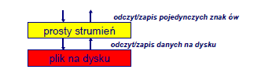
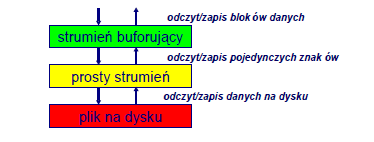
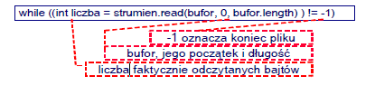

# Lab12 - Obsługa strumieniu w języku Java

Strumień (stream) to sekwencja danych, najczęściej bajtów. Pochodzenie oraz typ sekwencji danych
zależny jest od danego środowiska. Podstawowe typy strumieniu związane są z operacjami wejściawyjścia.
W języku Java do obsługi operacji wejścia utworzono klasą InputStream, natomiast do
operacji wyjścia OutputStrem. Strumienie związane są z typem obszaru (urządzenia), z którego
sekwencja danych jest odczytywana lub zapisywana. Takimi urządzeniami mogą być:
- pamięć operacyjna,
- dyski twarde,
- ekran,
- drukarka,
- sieć, itd.

Do typów danych, które są wykorzystywane przez strumienie do przesyłania informacji należą:
- byte,
- String,
- Object.

```
1.AudioInputStream
2.ByteArrayInputStream
3. FileInputStream
4. FilterInputStream
  1.BufferedInputStream
  2.CheckedInputStream
  3.CipherInputStream
  4.DataInputStream
  5.DigestInputStream
  6. InflaterInputStream
  7.LineNumberInputStream
  8. ProgressMonitorInputStream
  9. PushbackInputStream
5. InputStream
6.ObjectInputStream
7. PipedInputStream
8. SequenceInputStream
9. StringBufferInputStream
1.ByteArrayOutputStream
2. FileOutputStream
3. FilterOutputStream
  1.BufferedOutputStream
  2.CheckedOutputStream
  3.CipherOutputStream
  4.DataOutputStream
  5.DeflaterOutputStream
  6.DigestOutputStream
  7. PrintStream
4.ObjectOutputStream
5.OutputStream
6. PipedOutputStream
```
W języku java strumienie obsługiwane są przez klasy `OutputStream` oraz `InputStream` reprezentują
je jako sekwencje bajtów - elementów typu `byte`. Najczęściej jednak zachodzi potrzeba
formatowania danych strumienia. Dokonuje się tego w języku Java przy wykorzystaniu różnych
klas formatujących, które dziedziczą po `OutputStream` i `InputStream`. Przykładowo pisanie tekstu w
konsoli realizowane jest przy użyciu `System.out.println()`, przy czym out jest obiektem klasy
`PrintStream`, która stanowy klasę formatującą bajty sekwencji pochodzących z `OutputStream` na
tekst. W java zaimplementowano również klasy `Reader` oraz `Writer`, które stanowią analogię do klas
`InputStream` oraz `OutputStream`, przy czym służą one do obsługi danych tekstowych (String).
Obsługa wejścia – klasa `InputStream`
Klasa `InputStream` jest klasą abstrakcyjną. Zawiera podstawowe metody, które
umożliwiają odczytywanie oraz kontrolę bajtów ze strumienia. Ponieważ jest abstrakcyjną
nie można dynamicznie utworzyć obiektu tej klasy, lecz można go uzyskać przez
odwołanie się do standardowego wejścia zainicjowanego zawsze w polu in klasy `System`,
czyli `System.in`. Istnieją także inne możliwości uzyskania obiektu klasy `InputStream` np.
wywołanie metod zwracających referencję do obiektu tego typu tj. np.: metoda
`getInputStream()` zdefiniowana w klasie `Socket`. Metoda `read()` - czytająca kolejny bajt ze
strumienia wejściowego, jest jedyną metodą abstrakcyjną w klasie `InputStrem` i to ona
czyni ją klasą abstrakcyjną. 
Pozostałe metody umożliwiają:

-odczyt bajtów do zdefiniowanej tablicy
```
int read(byte b[]);
```
```
int read(byte b[], int offset, int length);
```

- pominięcie określonej liczby bajtów w odczycie:
```long skip(long n);```

- kontrolę stanu strumienia (czy są dane):
```
int available();
```
- tworzenie markerów:
```
boolean markSupported(); // kontrola czy tworzenie markerów
// jest możliwe
synchronized void mark(int readlimit);
synchronized void reset();
```
- zamknięcie strumienia
```
void close();
```

Prawie wszystkie metody oprócz `markSupported()` i `mark()` mogą generować
wyjątki, które muszą być zadeklarowany lub obsługiwany w kodzie programu. Dla strumieni
podstawową klasą wyjątków jest `IOException`.
Obsługa wejścia – klasa `OutputStream`
Podobnie do klasy `InputStream` zdefiniowana jest klasa `OutputStream`, dotycząca obsługi wyjścia.
Klasa analogicznie do poprzednio omawianej jest abstrakcyjna ze względu na jedyną metodę
abstrakcyjną metodą `write()`, która zapisuje kolejne bajty do strumienia. Do podstawowych
metod `OutputStream` klasy zaliczyć można:
- zapisują dane z tablicy b do strumienia wyjścia
```
void write(byte[] b, int off, int len);
void write(byte[] b);
```
- zamknięcie strumienia
```
void close() ;
```
- przesuwanie buforowanych danych do strumienia
```
void flush();
```
Poniższy program ukazuje proste zastosowanie strumieni.
```
import java.io.*;

public class Echo{
  public static void main(String args[]){
    byte b[] = new byte[100];
    try{
      System.in.read(b);
      System.out.write(b);
      System.out.flush();
    } catch (IOException ioe){
        System.out.println("Błąd wejścia-wyjścia");
      }
    }
}
```

Obsługa plików
Klasa `File` służy do opisu abstrakcyjnej reprezentacji ścieżek dostępu do plików oraz katalogów.
Ścieżki dostępu dzielą się ze względu na zasięg na względne (relatywne - podają ścieżkę do pliku
względem bieżącego katalogu) i bezwzględne (absolutne - podają ścieżkę do pliku względem
głównego korzenia systemu plików w danym systemie operacyjnym).
Można dokonać również podziału ze względu na środowisko, dla którego są definiowane, co
praktycznie dzieli ścieżki dostępu na zdefiniowane dla systemu Unix oraz MS Windows.

- absolutna ścieżka dostępu:
**UNIX:** /utl/software/java/projects
**MS Windows:** c:\utl\softare\java\projects

- relatywna ścieżka dostępu:
**UNIX:** java/projects
**MS Windows:** java\projects.

Przy tworzeniu obiektu klasy `File` dokonywana jest konwersja łańcucha znaków na abstrakcyjną
ścieżkę dostępu do pliku. Metody `klasyFile` umożliwiają kontrolę podanej ścieżki i plików (np.
`isFile()`, `isDirectory()`, `isHidden`, `canRead()`, itd.) oraz dokonywania konwersji (np. `getPath()`,
`getParent()`, `getName()`, `toURL()`, itp.) jak też wykonywania prostych operacji (`list()`, `mkdir()`, itp.).
Zapis tekstowy ścieżki dostępu dla środowiska MS Windows musi zawierać podwójny separator.
`c:\\java\\projekty\\strumienie`.
```
File plik = new File("c:\\dane.txt");
File katalog = new File("c:\\moje dokumenty");
File plik2 = new File(katalog, "nowy plik.txt");

import java.io.*;

public class PobierzDane{
  public static void main(String args[]){
    File f = new File("DANE1");
    if (f.mkdir()) {
      File g = new File (".");
      String s[] = g.list();
      for (int i =0; i<s.length; i++){
        System.out.println(s[i]);
      }
  } else {
      System.out.println("Błąd operacji I/O");
    }
  }
}
```
Znakowe strumienie plikowe

a) Służą do przesyłania znaków w standardzie Unicode o 16-bitowych kodach,

b) Mogą odczytywać (klasa FileReader) lub zapisywać (klasa FileWriter) pojedyncze znaki,

c) Często wewnętrznie obsługują przekodowanie znaków związane z niestandardowymi alfabetami.

<br>

**Odczyt z pliku tekstowego:**

Strumień `FileReader` odczytuje pojedyncze znaki ze strumienia znakowego otwartego pliku.
Wybrane metody:
```
int read() – odczyt jednego znaku (liczby int)
int read(char[] blok) – odczyt tablicy znaków
void close() – zamknięcie strumienia
FileReader plik = new FileReader("plikwe.txt"); char znak;
do {
  znak = (char) plik.read();
} while (znak != -1);
plik.close();
```


Wybrane metody
```
void write(int znak) – zapis jednego znaku
void write(char[] blok) – zapis tablicy znaków
void write(String napis) – zapis napisu
void append(char znak) – dołączenie znaku na końcu pliku
void flush() – przesuwanie buforowanych danych do strumienia
void close() – zamknięcie strumienia
FileWriter plik = new FileWriter ("plik.wy"); //utworz.
plik.write('A'); // zapis do strumienia
plik.close(); // zamknięcie strumienia
```
Strumienie buforujące:
Bezpośredni odczyt i zapis pojedynczych znaków jest nieefektywny:
przykład:odczytaj 1 000 000 znaków za pomocą pętli
W takiej sytuacji wykorzystuje się strumienie buforujące, operujące na innych, prostszych
strumieniach. Posiadają one możliwość buforowania danych, tak aby można było przetwarzać
większe ich informacji.

<br>

```
public class Kopiowanie {
public static void main(String[] args) {
  try {
    FileReader we = new FileReader("C:/plik1.txt");
    BufferedReader buforWe = new BufferedReader(we);
    FileWriter wy = new FileWriter("C:/plik2.txt");
    BufferedWriter buforWy = new BufferedWriter(wy);
    String linia;
    while ((linia = buforWe.readLine()) != null) {
      buforWy.write(linia);
    }
    buforWe.close(); buforWy.close();
    } catch (IOException ex) {
    System.err.println("Błąd: " + e); }
  }
}
```

Binarne strumienie plikowe
Binarne strumienie służą do odczytu (klasa FileInputStream) i zapisu (klasa FileOutputStream)
danych binarnych. Podstawową jednostką zapisu jest bajt (8 bitów).
W strumieniach binarnych, inaczej niż w tekstowych, nigdy nie dochodzi do przekodowania
danych. Są one zapisywane dokładnie w takiej postaci, w jakiej je przekazano.
```
FileInputStream in = new FileInputStream("plik.we");
FileOutputStream out = new FileOutputStream("plik.wy");
```
Odczyt z pliku binarnego:
Strumień FileInputStream odczytuje ze strumienia binarnego otwartego w pliku pojedyncze bajty
Wybrane metody:
```
int read() – odczyt jednego znaku (liczby int)
int read(byte[] blok) – odczyt tablicy bajtów
void close() – zamknięcie strumienia
FileInputStream plik = new FileInputStream("plikwe.dat");
int bajt;
do {
  bajt = plik.read();
} while (bajt != -1); // odczyt dopóki nie wystąpi koniec pliku
plik.close(); // zamknięcie strumienia
public class OdczytBinarny {
  public static void main(String[] args) {
    try {
      FileInputStream we = new FileInputStream("x");
      byte bajt;
      while ((bajt = we.read()) != -1 {
        // ...
      }
      strumienWe.close();
     } catch (IOException ex) {
     System.err.println("Błąd: " + e);
    }
  }
}
```
Zapis do pliku binarnego:
Strumień `FileOutputStream` zapisuje do strumienia binarnego otwartego w pliku pojedyncze bajty
Wybrane metody:
```
void write(int znak) – zapis jednego bajtu
void write(byte[] blok) – zapis tablicy bajtów
void flush() – przesuwanie buforowanych danych do strumienia
void close() – zamknięcie strumienia
FileWriter plik = new FileWriter ("plikwy.dat");
plik.write('A'); // zapisany zostaje kod znaku 'A'
plik.close();
public class ZapisBinarny {
  public static void main(String[] args) {
    try {
      FileOuputStream wy = new FileOutputStream("plik.wy");
      for (int i = 0; i < 255; i++) {
        strumienWy.write(i);
      }
      strumienWy.close();
      } catch (IOException ex) {
      System.err.println("Błąd: " + e);
     }
  }
}
```
Buforowanie dostępu do pliku binarnego:
Podobnie jak w przypadku strumieni znakowych, strumienie binarne też mogą być buforowane.
Odpowiadają za to klasy BufferedInputStream i BufferedOutputStream.
Zapis buforowany `(BufferedOutputStream)`
```
int write(byte[] bufor, int poczatek, int długosc)
```
Odczyt buforowany (BufferedInputStream)
```
int read(byte[] bufor, int poczatek, int długosc)
```
<br>
```
public class BuforOdczytBinarny {
  public static void main(String[] args) {
    try {
      FileInputStream we = new FileOutputStream("pl.wy");
      BufferedInputStream buforWe = new BufferedInputStream(we);
      char[] bufor = new char[1024];
      while ((int liczba =
        buforWe.read(bufor, 0, bufor.length)) != -1) {
        // tu można coś zrobić z zawartością bufora
      }
      buforWe.close();
    } catch (IOException ex) {
    System.err.println("Błąd: " + e);
    }
  }
}
while ((int liczba = strumien.read(bufor, 0, bufor.length) ) != -1)
```
liczba faktycznie odczytanych bajtów
bufor, jego początek i długość
-1 oznacza koniec pliku
Niemal wszystkie operacje wejścia-wyjścia zgłaszają wyjątek `IOException`, dlatego wykonanie
większości z nich wymaga objęcia w klauzulę try...catch
Strumienie poza `java.io`
W Javie istnieją również inne strumienie zdefiniowane poza pakietem `java.io`. Na przykład w
pakiecie `java.util.zip` zdefiniowano szereg klas strumieni do obsługi kompresji w formie ZIP i GZIP.
Do zawartych tam podstawowych klasy strumieni zalicza się:
- CheckedInputStream
- CheckedOutputStream
- DeflaterOutputStream
- GZIPInputStream
- GZIPOutputStream
- InflaterInputStream
- ZipInputStream
- ZipOutputStream
- 
Przykładowy kod realizujący kompresję pliku metodą GZIP:
```
import java.io.*;
import java.util.zip.*;
public class Kompresja {
  public static void main(String args[]){
    String s;
    byte b[] = new byte[100];
    for (int i=0; i<100; i++){
      b[i]=(byte) (i/10);
    }
    try{
      FileOutputStream o = new FileOutputStream("plik2.txt");
      o.write(b);
      o.flush();
      o.close();
      FileOutputStream fos = new FileOutputStream("plik2.gz");
      GZIPOutputStream z = new GZIPOutputStream(new
      BufferedOutputStream(fos));
      z.write(b,0,b.length);
      z.close();
    } catch (Exception e){}
  }
}
```
W programie tworzona jest tablica bajtów wypełniana kolejnymi wartościami od 1 do 10. Następnie
tablica ta przesyłana do strumieni wyjściowych raz bezpośrednio do pliku, drugi raz poprzez
kompresję metodą GZIP. W wyniku działania programu uzyskuje się dwa pliki: bez kompresji
`plik2.txt` i z kompresją `plik2.gz`.

## **Zadania:**

### **Zadanie 1.** 
Utwórz program umożliwiający odczytanie pliku z rozszerzeniem class. Wypisz 20 pierwszych
bajtów na konsolę z zapisie `HEX`.
### **Zadanie 2.** 
Utwórz aplikację, czytającą dowolny plik tekstowy (linia po linii) i wypisującą zawartość tego
pliku na konsoli.
### **Zadanie 3.**  
Zmodyfikuj poprzedni program, w taki sposób aby pytał o nazwę pliku do wypisania oraz czy
wypisywać kolejny plik. Obsłuż mogące się pojawiać wyjątki.
### **Zadanie 4.** 
Rozszerz klasę `KompresjaGZIP` z wykładu o kod potwierdzający, czy rzeczywiście kompresja
jest odwracalna. Do weryfikacji użyj sumy kontrolnej `CRC32`.
### **Zadanie 5.**  
Utwórz program kopiujący znak po znaku pliki tekstowe. Za kopiowanie powinna odpowiadać
wydzielona metoda `echo(Reader, Writer)`. Nie obsługuj żadnych wyjątków, ale pamiętaj o
właściwym zamykaniu obu plików.
### **Zadanie 6.**  
Rozszerz poprzednie zadanie tak, aby czas kopiowania był mierzony i wypisywany na konsolę.
Sprawdź jaki wpływ na efektywność ma użycie buforowania.
