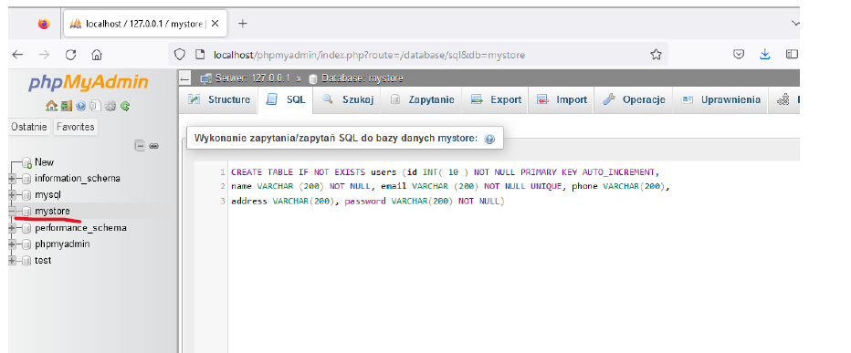
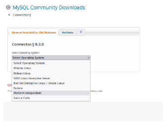
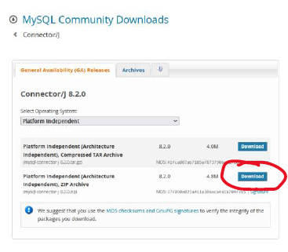
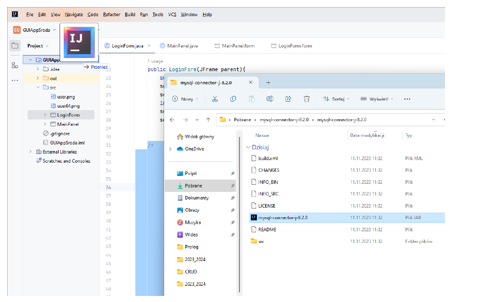
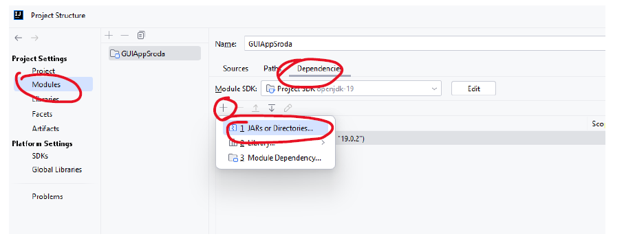
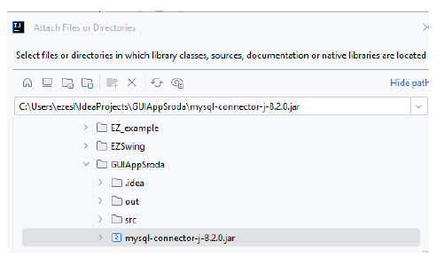
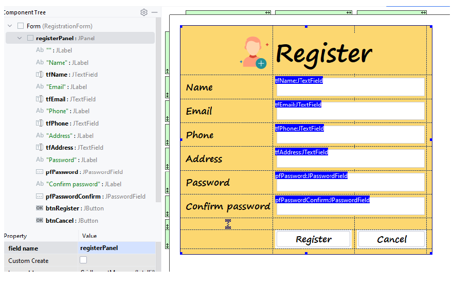
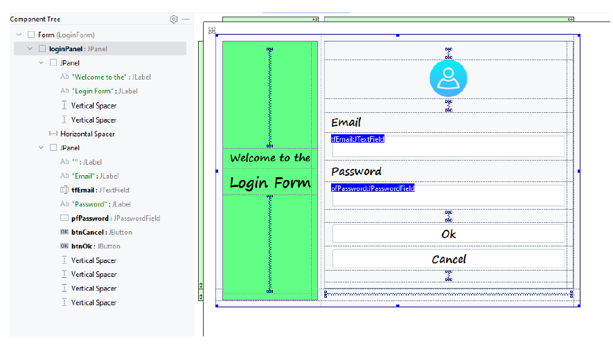
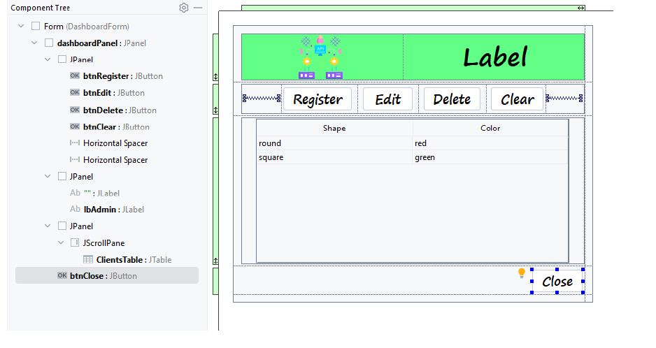

# Example CRUD Java Swing

## Ćwiczenie 
polega na stworzeniu projektu zawierającego operacje CRUD z użyciem zewnętrznej bazy. W tym celu należy zrealizować poszczególne kroki w poniższej instrukcji:

### Krok 1.
Baza danych – xampp , tworzymy bazę danych z wykorzystaniem xampp

Zgodnie z poniższym rysunkiem

 

Bazę stworzymy z użyciem mysql connector of java [link](https://dev.mysql.com/downloads/connector/j/) - należy to pobrać. Wybrać platformę zgodnie z poniższym rysunkiem.

 

oraz pobrać plik:

 

Pobrany plik należy rozpakować i plik JAR dodać do projektu poprzez przeciągniecie go na nazwę naszego projektu

 

Plik został dodany następnie należy przejść do ustawień projektu File ->Project Structure

 

Klikamy na + i pojawi się poniższe okienko i wybieramy nasz wcześniej dodany plik, klikamy OK

 

Krok 2.
Utworzyć poniższe widoki formularzy – nie muszą być identyczne, ikony można pobrać ze strony [link](https://www.flaticon.com)

 

 

 
