# PROGRAMOWANIE OBIEKTOWE
## GUI JAVA SWING LABORATORIUM
## JPANEL, LAYOUT MANAGER, JBUTTON, JLABEL, JTEXTFIELD

### TWORZENIE PROJEKTU
`File`->`New Project`->Wybieramy utworzenie projektu `Java (1)` oraz wersję `SDK (2)`, przechodzimy
`dalej (3)` i w kolejnym oknie wpisujemy `nazwę projektu (4)` i go `tworzymy (5)`.

<br>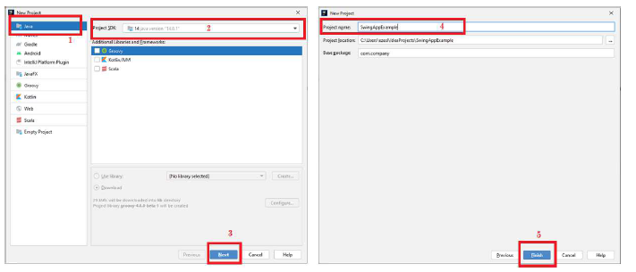

W kolejnym kroku należy utworzyć **Swing UI Designer GUI From**. W kolejnym okienku wpisujemy
nazwę oraz możemy zdefiniować base layout.

<br>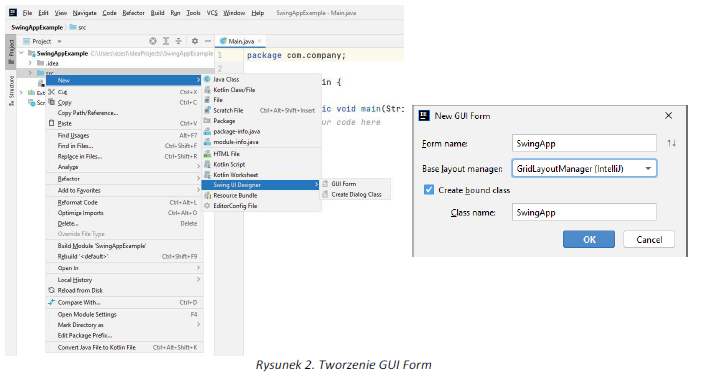

Widok po utworzeniu GUI:
<br>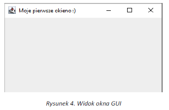

**JFRAME**
<br>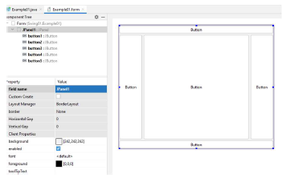


```
public class Example01 extends JFrame {
  private JPanel JPanel1;
  public static void main(String[] args) {
    Example01 SwingExample = new Example01();
    SwingExample.setVisible(true); //*wyświetlanie ramki *//*
  }
  //konstruktor
  public Example01(){
    //I sposób poprzez dziedzczenie z JFrame
    super("Moje pierwsze okieno :) ");
    this.setContentPane(this.JPanel1); // wyświetlenei na ekranie
    this.setDefaultCloseOperation(JFrame.EXIT_ON_CLOSE);//metoda pozwalająca na
    zamknięcie okna
    //this.pack();
    /*upakowanie okna zgodnie z preferowanymi rozmiarami komponentów,
    które są zawarte w Frame, rozmair będzie się doaposowywał do rozmiaru */
  }
}
```

**LAYOUT MANAGER**

W Javie możemy umieszczać komponenty w następującym układzie:

**a) BorderLayout**
<br>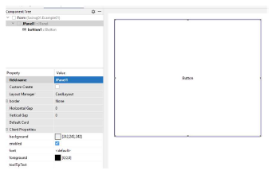

**b) CardLayout**
<br>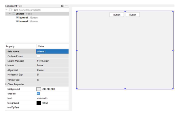

**c) FlowLayout**
<br>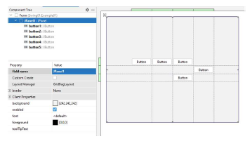

**d) GridBagLayout**
<br>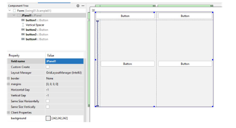

**e) GridLayoutManager IntelliJ**
Pozwala na umieszczanie komponentów w siatce kolumn i wierszy, a ich rozmiar może być różny.
<br>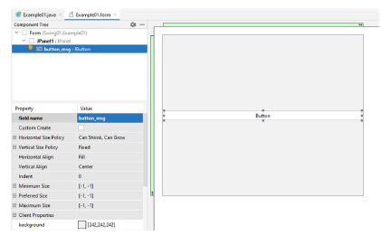

**JBUTTON**
`public class JButton extends AbstractButton implements Accessible`
**Commonly used Constructors:**

| Constructor       | Description                                           |
|-------------------|-------------------------------------------------------|
| `JButton()`       | It creates a button with no text and icon.            |
| `JButton(String s)` | It creates a button with the specified text.         |
| `JButton(Icon i)` | It creates a button with the specified icon object.   |

**Commonly used Methods of AbstractButton class:**

| Methods                            | Description                                        |
|------------------------------------|----------------------------------------------------|
| `void setText(String s)`           | It is used to set specified text on button.        |
| `String getText()`                 | It is used to return the text of the button.       |
| `void setEnabled(boolean b)`       | It is used to enable or disable the button.        |
| `void setIcon(Icon b)`             | It is used to set the specified Icon on the button.|
| `Icon getIcon()`                   | It is used to get the Icon of the button.          |
| `void setMnemonic(int a)`          | It is used to set the mnemonic on the button.      |
| `void addActionListener(ActionListener a)` | It is used to add the action listener to this object.|

<br>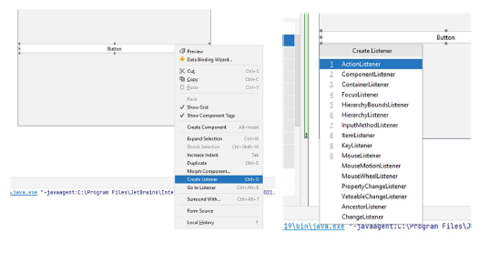

### **Przykład 1.** 
_Należy utworzyć dwa przyciski, które pozwolą na wyjście z programu oraz
wyświetlenie informacji._

Po dodaniu przycisku należy użyć Create Listener Ctlt+O, a następnie wybrać ActionListener, a następnie
utworzyć automatycznie metodę `actionPerformed`
Kody metod:
```
button_msg.addActionListener(new ActionListener() {
  @Override
  public void actionPerformed(ActionEvent e) {
    JOptionPane.showMessageDialog(null,"Hello");
  }
});
```
```
buttonClose.addActionListener(new ActionListener() {
  @Override
  public void actionPerformed(ActionEvent e) {
    dispose(); //metoda wyjścia
  }
});
```
```
buttonDate.addActionListener(new ActionListener() {
  @Override
  public void actionPerformed(ActionEvent e) {
  //System.out.println(new Date());
    JOptionPane.showMessageDialog(null,new Date());
  }
});
```

**JLABEL**
`public class JLabel extends JComponent implements SwingConstants,
Accessible`

**Commonly used Constructors:**

| Constructor                                | Description                                      |
|--------------------------------------------|--------------------------------------------------|
| `JLabel()`                                 | Creates a JLabel instance with no image and with an empty string for the title.  |
| `JLabel(String s)`                          | Creates a JLabel instance with the specified text.                           |
| `JLabel(Icon i)`                            | Creates a JLabel instance with the specified image.                          |
| `JLabel(String s, Icon i, int horizontalAlignment)` | Creates a JLabel instance with the specified text, image, and horizontal alignment.|

**Commonly used Methods:**

| Methods                                  | Description                                               |
|------------------------------------------|-----------------------------------------------------------|
| `String getText()`                       | It returns the text string that a label displays.          |
| `void setText(String text)`              | It defines the single line of text this component will display. |
| `void setHorizontalAlignment(int alignment)` | It sets the alignment of the label's contents along the X axis. |
| `Icon getIcon()`                         | It returns the graphic image that the label displays.      |
| `int getHorizontalAlignment()`           | It returns the alignment of the label's contents along the X axis. |

### **Przykład 2.** 
_Należy utworzyć GUI zgodnie z poniższym rysunkiem oraz zaimplantować następujące
zdarzenia:
• Przycik Close zamyka okno.
• Display the date – wyświetla aktualną date w JLabel._

<br>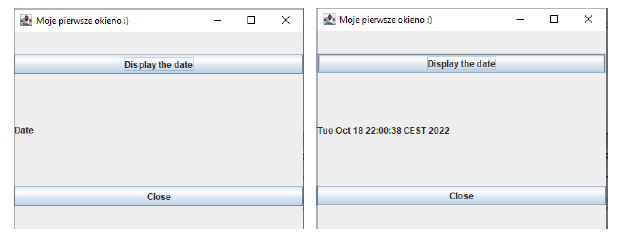

**JTEXTFIELD**
`public class JTextField extends JTextComponent implements SwingConstants`
**Commonly used Constructors:**

| Constructor                              | Description                                               |
|------------------------------------------|-----------------------------------------------------------|
| `JTextField()`                           | Creates a new TextField                                   |
| `JTextField(String text)`                | Creates a new TextField initialized with the specified text. |
| `JTextField(String text, int columns)`   | Creates a new TextField initialized with the specified text and columns. |
| `JTextField(int columns)`                | Creates a new empty TextField with the specified number of columns. |

**Commonly used Methods:**

| Methods                                   | Description                                               |
|-------------------------------------------|-----------------------------------------------------------|
| `void addActionListener(ActionListener l)` | It is used to add the specified action listener to receive action events from this textfield. |
| `Action getAction()`                      | It returns the currently set Action for this ActionEvent source, or null if no Action is set. |
| `void setFont(Font f)`                    | It is used to set the current font.                       |
| `void removeActionListener(ActionListener l)` | It is used to remove the specified action listener so that it no longer receives action events from this textfield. |

### **Przykład 3.**
_Po podaniu a i b i przyciśnięci przycisku suma lub różnica pojawi się wynik działania, close
Zamyka okno._
<br>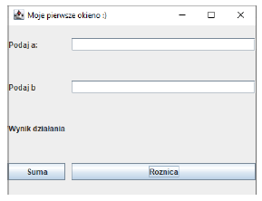

### **Zadanie 1. 
_Należy zaproponować aplikację GUI do konwersji temperatury Celsjusza na Farenheit.
Aplikacja powinna posiadać następujące funkcjonalności:
• Wpisywanie temp w stopniach Celsjusza.
• Pole w którym po przyciśnięciu przycisku konwertuj pojawi się wynik._

### **Zadanie 2.** 
_Wykorzystując poznane komponenty należy zaprojektować aplikacje/klika, która/e
zaprezentuje/ą użycie dostępnych metod dla omawianych komponentów._
