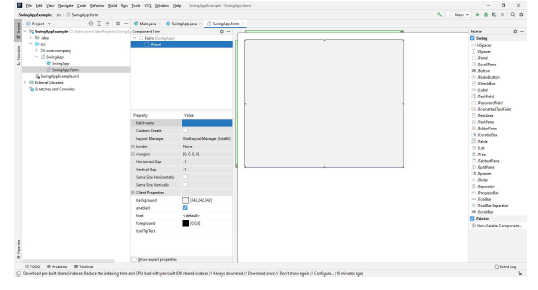

# PROGRAMOWANIE OBIEKTOWE
## GUI JAVA SWING LABORATORIUM
## JPANEL, LAYOUT MANAGER, JBUTTON, JLABEL, JTEXTFIELD

### TWORZENIE PROJEKTU
`File`->`New Project`->Wybieramy utworzenie projektu `Java (1)` oraz wersję `SDK (2)`, przechodzimy
`dalej (3)` i w kolejnym oknie wpisujemy `nazwę projektu (4)` i go `tworzymy (5)`.

 

W kolejnym kroku należy utworzyć **Swing UI Designer GUI From**. W kolejnym okienku wpisujemy
nazwę oraz możemy zdefiniować base layout.

 

Widok po utworzeniu GUI:

 

**JFRAME**

 

public class Example01 extends JFrame {
private JPanel JPanel1;
public static void main(String[] args) {
Example01 SwingExample = new Example01();
SwingExample.setVisible(true); //*wyświetlanie ramki *//*
}
//konstruktor
public Example01(){
//I sposób poprzez dziedzczenie z JFrame
super("Moje pierwsze okieno :) ");
this.setContentPane(this.JPanel1); // wyświetlenei na ekranie
this.setDefaultCloseOperation(JFrame.EXIT_ON_CLOSE);//metoda pozwalająca na
zamknięcie okna
//this.pack();
/*upakowanie okna zgodnie z preferowanymi rozmiarami komponentów,
które są zawarte w Frame, rozmair będzie się doaposowywał do rozmiaru */
}
}

LAYOUT MANAGER
W Javie możemy umieszczać komponenty w następującym układzie:
a) BorderLayout
b) CardLayout
c) FlowLayout
d) GridBagLayout
e) GridLayoutManager IntelliJ
Pozwala na umieszczanie komponentów w siatce kolumn i wierszy, a ich rozmiar może być różny.
JBUTTON
public class JButton extends AbstractButton implements Accessible
Commonly used Constructors:

Przykład 1. Należy utworzyć dwa przyciski, które pozwolą na wyjście z programu oraz
wyświetlenie informacji.
Po dodaniu przycisku należy użyć Create Listener Ctlt+O, a następnie wybrać ActionListener, a następnie
utworzyć automatycznie metodę actionPerformed
Kody metod:
button_msg.addActionListener(new ActionListener() {
@Override
public void actionPerformed(ActionEvent e) {
JOptionPane.showMessageDialog(null,"Hello");
}
});
buttonClose.addActionListener(new ActionListener() {
@Override
public void actionPerformed(ActionEvent e) {
dispose(); //metoda wyjścia
}
});
buttonDate.addActionListener(new ActionListener() {
@Override
public void actionPerformed(ActionEvent e) {
//System.out.println(new Date());
JOptionPane.showMessageDialog(null,new Date());
}
});
JLABEL
public class JLabel extends JComponent implements SwingConstants,
Accessible
Commonly used Constructors:

Commonly used Methods:

Przykład 2. Należy utworzyć GUI zgodnie z poniższym rysunkiem oraz zaimplantować następujące
zdarzenia:
• Przycik Close zamyka okno.
• Display the date – wyświetla aktualną date w JLabel.
JTEXTFIELD
public class JTextField extends JTextComponent implements SwingConstants
Commonly used Constructors:
Commonly used Methods:
Przykład 3. Po podaniu a i b i przyciśnięci przycisku suma lub różnica pojawi się wynik działania, close
Zamyka okno.
Zadanie 1. Należy zaproponować aplikację GUI do konwersji temperatury Celsjusza na Farenheit.
Aplikacja powinna posiadać następujące funkcjonalności:
• Wpisywanie temp w stopniach Celsjusza.
• Pole w którym po przyciśnięciu przycisku konwertuj pojawi się wynik.
Zadanie 2. Wykorzystując poznane komponenty należy zaprojektować aplikacje/klika, która/e
zaprezentuje/ą użycie dostępnych metod dla omawianych komponentów.
