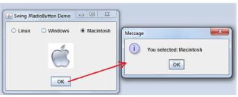
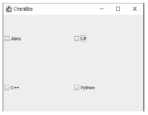

# PROGRAMOWANIE OBIEKTOWE
## GUI JAVA SWING LABORATORIUM
### JCHACKBOX, JPASSWORDFIELD, JRADIOBUTTON, JTEXTAREA

### JTEXTAREA
```
public class JTextArea extends JTextComponent
```
**Commonly used Constructors:**

| Constructor                          | Description                                                                                |
|--------------------------------------|--------------------------------------------------------------------------------------------|
| `JTextArea()`                        | Creates a text area that displays no text initially.                                       |
| `JTextArea(String s)`                | Creates a text area that displays specified text initially.                                |
| `JTextArea(int row, int column)`     | Creates a text area with the specified number of rows and columns that displays no text initially. |
| `JTextArea(String s, int row, int column)` | Creates a text area with the specified number of rows and columns that displays specified text.   |

**Commonly used Methods:**

| Methods                         | Description                                                                          |
|---------------------------------|--------------------------------------------------------------------------------------|
| `void setRows(int rows)`        | It is used to set specified number of rows.                                          |
| `void setColumns(int cols)`     | It is used to set specified number of columns.                                       |
| `void setFont(Font f)`          | It is used to set the specified font.                                                |
| `void insert(String s, int position)` | It is used to insert the specified text on the specified position.                  |
| `void append(String s)`         | It is used to append the given text to the end of the document.                      |

### PRZYKŁAD 1– KOD ŹRÓDŁOWY DOSTĘPNY W UDOSTĘPNIONYCH MATERIAŁACH.
```java
package JTextArea;
import javax.swing.*;
import java.awt.*;
import java.awt.event.ActionEvent;
import java.awt.event.ActionListener;

public class TextAreaExample extends JFrame implements ActionListener {
  // JFrame
  static JFrame f;
  // JButton
  static JButton b, b1, b2, b3;
  // label to display text
  static JLabel l, l1;
  // text area
  static JTextArea jt;
  // default constructor
  TextAreaExample(){ }

  // main class
  public static void main(String[] args)
  {
    // create a new frame to store text field and button
    f = new JFrame("textfield");
    // create a label to display text
    l = new JLabel("nothing entered");
    l1 = new JLabel("0 lines");
    // create a new buttons
    b = new JButton("submit");
    b1 = new JButton("plain");
    b2 = new JButton("italic");
    b3 = new JButton("bold");
    // create a object of the text class
    TextAreaExample te = new TextAreaExample();
    // addActionListener to button
    b.addActionListener(te);
    b1.addActionListener(te);
    b2.addActionListener(te);
    b3.addActionListener(te);
    // create a text area, specifying the rows and columns
    jt = new JTextArea("please write something ", 10, 10);
    JPanel p = new JPanel();
    // add the text area and button to panel
    p.add(jt);
    p.add(b);
    p.add(b1);
    p.add(b2);
    p.add(b3);
    p.add(l);
    p.add(l1);
    f.add(p);
    // set the size of frame
    f.setSize(300, 300);
    f.show();
  }

  // if the button is pressed
  public void actionPerformed(ActionEvent e)
  {
    String s = e.getActionCommand();
    if (s.equals("submit")) {
      // set the text of the label to the text of the field
      l.setText(jt.getText() + ", ");
      l1.setText(jt.getLineCount() + " lines");
    }
    else if (s.equals("bold")) {
      // set bold font
      Font f = new Font("Serif", Font.BOLD, 15);
      jt.setFont(f);
    }
    else if (s.equals("italic")) {
      // set italic font
      Font f = new Font("Serif", Font.ITALIC, 15);
      jt.setFont(f);
    }
    else if (s.equals("plain")) {
      // set plain font
      Font f = new Font("Serif", Font.PLAIN, 15);
      jt.setFont(f);
    }
  }
}
```

### JPASSWORDFIELD
```
public class JPasswordField extends JTextField
```

**Commonly used Constructors:**

| Constructor                           | Description                                                                                                 |
|---------------------------------------|-------------------------------------------------------------------------------------------------------------|
| `JPasswordField()`                    | Constructs a new JPasswordField, with a default document, null starting text string, and 0 column width.    |
| `JPasswordField(int columns)`         | Constructs a new empty JPasswordField with the specified number of columns.                                 |
| `JPasswordField(String text)`         | Constructs a new JPasswordField initialized with the specified text.                                        |
| `JPasswordField(String text, int columns)` | Construct a new JPasswordField initialized with the specified text and columns.                             |

### Ćwiczenie 1. 
Należy zaproponować GUI pokazane na rysunku poniżej, które posiada następującefunkcjonalności: 
po podaniu username oraz password i kliknięciu w login w zakładce label mają pojawić
się wpisane dane.

<br>

### JRADIOBUTTON

```
public class JRadioButton extends JToggleButton implements Accessible
```
**Commonly used Constructors:**

| Constructor                           | Description                                                                          |
|---------------------------------------|--------------------------------------------------------------------------------------|
| `JRadioButton()`                      | Creates an unselected radio button with no text.                                      |
| `JRadioButton(String s)`              | Creates an unselected radio button with specified text.                               |
| `JRadioButton(String s, boolean selected)` | Creates a radio button with the specified text and selected status.                   |

**Commonly used Methods:**

| Methods                          | Description                                                                     |
|----------------------------------|---------------------------------------------------------------------------------|
| `void setText(String s)`         | It is used to set specified text on button.                                     |
| `String getText()`               | It is used to return the text of the button.                                    |
| `void setEnabled(boolean b)`     | It is used to enable or disable the button.                                     |
| `void setIcon(Icon b)`           | It is used to set the specified icon on the button.                             |
| `Icon getIcon()`                 | It is used to get the icon of the button.                                       |
| `void setMnemonic(int a)`        | It is used to set the mnemonic on the button.                                   |
| `void addActionListener(ActionListener a)` | It is used to add the action listener to this object.                         |

### Ćwiczenie 2. 
Zaprojektuj GUI według poniższego rysunku, a następnie zaimplementuj odpowiednie
działanie programu, które po wybraniu systemu wyświetli ikonę systemu, a naciśniecie przycisku OK
wyświetli komunikat wybranego systemu.

<br>
<br>

### JCHACKBOX
```
public class JCheckBox extends JToggleButton implements Accessible
```

**Commonly used Constructors:**

| Constructor                           | Description                                                                        |
|---------------------------------------|------------------------------------------------------------------------------------|
| `JCheckBox()`                         | Creates an initially unselected check box button with no text, no icon.             |
| `JCheckBox(String s)`                 | Creates an initially unselected check box with text.                                |
| `JCheckBox(String text, boolean selected)` | Creates a check box with text and specifies whether or not it is initially selected.|
| `JCheckBox(Action a)`                 | Creates a check box where properties are taken from the Action supplied.            |

**Commonly used Methods:**

| Methods                                    | Description                                                                   |
|--------------------------------------------|-------------------------------------------------------------------------------|
| `AccessibleContext getAccessibleContext()` | It is used to get the AccessibleContext associated with this JCheckBox.       |
| `protected String paramString()`           | It returns a string representation of this JCheckBox.                         |

Przykładowy interfejs GUI z elementami chackBox

<br>
<br>

### Ćwiczenie 3. 
Zaprojektuj aplikację zgodnie z poniższym rysunkiem. Użytkownik po wybraniu
odpowiedniego kursu i kliknięciu przycisku Ok otrzyma message z informacją końcowej cenie za
wybrane kursy.

<br>

## Zadania do samodzielnego rozwiązania
### Zadanie 1. 
Należy zaproponować aplikację GUI, której przykładowy wygląd przedstawiono poniżej,
aplikacja powinna posiadać następujące funkcjonalności:

<br>

• Po wpisaniu hasła i kliknięciu w OK aplikacja sprawdza poprawność haseł, w przypadku różnych haseł powinien pojawić się message „Passwords are not matched!”

<br>

• Jeżeli podane hasłą są zgodne, ale nie są równe („codejava”) pojawi się komunikat:

<br>

• Jeżeli oba hasła są równe („codejava”) ma pojawić się komunikat:

<br>

### Zadanie 2. 
Wykorzystując poznane komponenty należy zaprojektować aplikacje, która zaprezentuje
użycie dostępnych metod dla omawianych komponentów.
