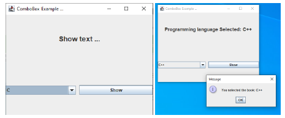
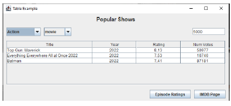
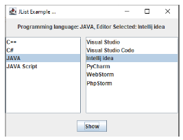
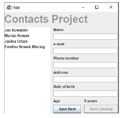

# PROGRAMOWANIE OBIEKTOWE
## GUI JAVA SWING LABORATORIUM
### JCOMBOBOX, JTABLE, JLIST, JOPTIONPANE, JSCROLLBAR

### JCOMBOBOX 
```
public class JComboBox extends JComponent implements ItemSelectable, ListDataListener, ActionListener, Accessible
```
Commonly used Constructors:

| Constructor                     | Description                                                     |
|--------------------------------|-----------------------------------------------------------------|
| `JComboBox()`                   | Creates a JComboBox with a default data model.                  |
| `JComboBox(Object[] items)`     | Creates a JComboBox that contains the elements in the specified array. |
| `JComboBox(Vector<?> items)`    | Creates a JComboBox that contains the elements in the specified Vector. |

Commonly used Methods:

| Methods                               | Description                                                        |
|---------------------------------------|--------------------------------------------------------------------|
| `void addItem(Object anObject)`       | It is used to add an item to the item list.                        |
| `void removeItem(Object anObject)`    | It is used to delete an item to the item list.                     |
| `void removeAllItems()`               | It is used to remove all the items from the list.                  |
| `void setEditable(boolean b)`         | It is used to determine whether the JComboBox is editable.         |
| `void addActionListener(ActionListener a)` | It is used to add the ActionListener.                              |

### ĆWICZENIE 1.
Zaimplantuj aplikacje zgodnie z poniższym widokiem.

<br>

Po wybraniu odpowiedniego języka z listy rozwijalnej pojawi się tekst w label, po przyciśnięciu buton Show pojawi się massage z informacją o wybranym języku.

### JTABLE
Commonly used Constructors:

| Constructor                         | Description                             |
|-------------------------------------|-----------------------------------------|
| `JTable()`                          | Creates a table with empty cells.       |
| `JTable(Object[][] rows, Object[] columns)` | Creates a table with the specified data.|

### ĆWICZENIE 2
Zaprojektuj aplikację według podanego poniżej widoku.

<br>

### JLIST 
```public class JList extends JComponent implements Scrollable, Accessible
```
Commonly used Constructors:

| Constructor                            | Description                                      |
|----------------------------------------|--------------------------------------------------|
| `JList()`                              | Creates a JList with an empty, read-only, model. |
| `JList(array[] listData)`               | Creates a JList that displays the elements in the specified array.       |
| `JList(ListModel<array> dataModel)`    | Creates a JList that displays elements from the specified, non-null, model.|

Commonly used Methods:

| Constructor                                     | Description                                             |
|-------------------------------------------------|---------------------------------------------------------|
| `void addListSelectionListener(ListSelectionListener listener)` | It is used to add a listener to the list, to be notified each time a change to the selection occurs. |
| `int getSelectedIndex()`                        | It is used to return the smallest selected cell index.  |
| `ListModel getModel()`                          | It is used to return the data model that holds a list of items displayed by the JList component. |
| `void setListData(Object[] listData)`           | It is used to create a read-only ListModel from an array of objects. |

### ĆWICZENIE 3.
Zaimplantuj aplikacje zgodnie z poniższym widokiem.

<br>

Zadania do samodzielnego rozwiązania

### Zadanie 1. 
Należy zaproponować aplikację GUI, której przykładowy wygląd przedstawiono poniżej, aplikacja powinna posiadać następujące funkcjonalności:

<br>

• Po włączeniu aplikacji przycisk Save Existing jest nieaktywny

• Po wybraniu osoby z listy w odpowiednich polach pojawiają się niezbędne informacje oraz zamiast tekstu 0 yers pojawia się informacje o wieku danej osoby.

• Użytkownik ma możliwość wprowadzenia nowych osób poprzez wpisanie danych zgodnie z wymaganiami i kliknięciu Save New.

• Save Existing pozwala na zapisanie zmodyfikowanych danych danego użytkownika.
