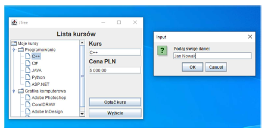
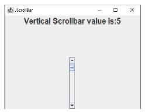
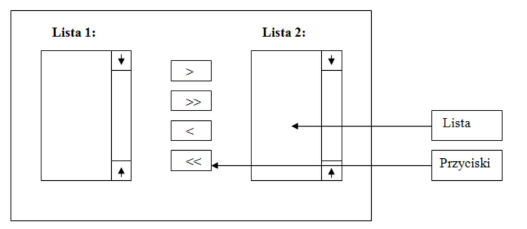
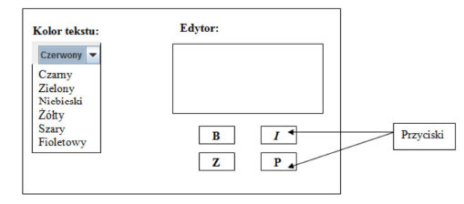

# PROGRAMOWANIE OBIEKTOWE
## GUI JAVA SWING LABORATORIUM
### JTREE, JTABBEDPANE, JSPLITPANE, JEDITORPANE, JSCROLLBAR
### JTREE
```
public class JTree extends JComponent implements Scrollable, Accessible
```
Commonly used Constructors:

| Constructor                  | Description                                                                         |
|------------------------------|-------------------------------------------------------------------------------------|
| `JTree()`                    | Creates a JTree with a sample model.                                                |
| `JTree(Object[] value)`      | Creates a JTree with every element of the specified array as the child of a new root node. |
| `JTree(TreeNode root)`       | Creates a JTree with the specified TreeNode as its root, which displays the root node.  |

ĆWICZENIE 1.
Zaimplantuj aplikacje zgodnie z poniższym widokiem.

<br>

Po wybraniu odpowiedniego kursu wyświetli się informacje o nazwie i cenie. Kliknięcie Opłać kurs
powoduje pojawienie się okienka do wpisania danych, wyjście zamyka okno.

### JTABBEDPANE
```
public class JTabbedPane extends JComponent implements Serializable, Accessible, SwingConstants
```

Commonly used Constructors:

| Constructor                                      | Description                                                                                   |
|--------------------------------------------------|-----------------------------------------------------------------------------------------------|
| `JTabbedPane()`                                  | Creates an empty TabbedPane with a default tab placement of JTabbedPane.Top.                  |
| `JTabbedPane(int tabPlacement)`                  | Creates an empty TabbedPane with a specified tab placement.                                   |
| `JTabbedPane(int tabPlacement, int tabLayoutPolicy)` | Creates an empty TabbedPane with a specified tab placement and tab layout policy.              |

### JSPLITPANE

Commonly used Constructors:

| Constructor                                                     | Description                                                                                     |
|-----------------------------------------------------------------|-------------------------------------------------------------------------------------------------|
| `JSplitPane()`                                                  | It creates a new JSplitPane configured to arrange the child components side-by-side horizontally, using two buttons for the components.                |
| `JSplitPane(int newOrientation)`                                | It creates a new JSplitPane configured with the specified orientation.                           |
| `JSplitPane(int newOrientation, boolean newContinuousLayout)`   | It creates a new JSplitPane with the specified orientation and redrawing style.                 |
| `JSplitPane(int newOrientation, boolean newContinuousLayout, Component newLeftComponent, Component newRightComponent)` | It creates a new JSplitPane with the specified orientation and redrawing style, and with the specified components.  |
| `JSplitPane(int newOrientation, Component newLeftComponent, Component newRightComponent)` | It creates a new JSplitPane with the specified orientation and the specified components.         |

### JEDITORPANE

Commonly used Constructors:

| Constructor                               | Description                                                                                   |
|-------------------------------------------|-----------------------------------------------------------------------------------------------|
| `JEditorPane()`                           | It creates a new JEditorPane.                                                                  |
| `JEditorPane(String url)`                 | It creates a JEditorPane based on a string containing a URL specification.                     |
| `JEditorPane(String type, String text)`   | It creates a JEditorPane that has been initialized to the given text.                          |
| `JEditorPane(URL initialPage)`            | It creates a JEditorPane based on a specified URL for input.                                   |

### JSCROLLBAR
```
public class JScrollBar extends JComponent implements Adjustable, Accessible
```
Commonly used Constructors:

| Constructor                                            | Description                                                                      |
|--------------------------------------------------------|----------------------------------------------------------------------------------|
| `JScrollBar()`                                         | Creates a vertical scrollbar with the initial values.                             |
| `JScrollBar(int orientation)`                          | Creates a scrollbar with the specified orientation and the initial values.       |
| `JScrollBar(int orientation, int value, int extent, int min, int max)` | Creates a scrollbar with the specified orientation, value, extent, minimum, and maximum. |

### PRZYKŁAD 1

<br>

```java
package LAB04;
import javax.swing.*;
import java.awt.event.AdjustmentEvent;
import java.awt.event.AdjustmentListener;

public class JScrollBar extends JFrame{
  private javax.swing.JPanel JPanel;
  private javax.swing.JScrollBar scrollBar1;
  private JLabel label;
  public static void main(String[] args) {
    JScrollBar example = new JScrollBar();
    example.setVisible(true);
  }
  public JScrollBar() {
    super("JScrollBar");
      this.setContentPane(this.JPanel);
      this.setDefaultCloseOperation(JFrame.EXIT_ON_CLOSE);
      this.setSize(400, 300);
    scrollBar1.addAdjustmentListener(new AdjustmentListener() {
    @Override
      public void adjustmentValueChanged(AdjustmentEvent e) {
        label.setText("Vertical Scrollbar value is:"+
        scrollBar1.getValue());
      }
    });
  }
}
```

### Zadania do samodzielnego rozwiązania
### Zadanie 1.
Utwórz okno aplikacji zawierające podstawowe komponenty interfejsu GUI w rozkładzie
przedstawionym na poniższym schemacie:

<br>

Do tak zaprojektowanego interfejsu dodaj następującą obsługę zdarzeń:
Naciśnięcie jednego z czterech przycisków powinno powodować generowanie następujących akcji:

• dla przycisku „>” – następuje przeniesienie zaznaczonego elementu z Listy 1 na Listę 2

• dla przycisku „>>” – następuje przeniesienie wszystkich elementów z Listy 1 na Listę 2

• dla przycisku „<”–następuje przeniesienie zaznaczonego elementu z Listy 2 na Listę 1

• dla przycisku „<<” – następuje przeniesienie wszystkich elementów z Listy 2 na Listę 1

### Zadanie 2.
Utwórz okno aplikacji edytora zawierające podstawowe komponenty interfejsu GUI w rozkładzie
przedstawionym na zamieszczonym schemacie.

<br>

Do zaprojektowanego interfejsu dodaj następującą obsługę zdarzeń:

• wybór jednego z sześciu dostępnych kolorów z listy rozwijalnej powinien pozwalać na
dokonanie modyfikacji koloru tekstu pola tekstowego edytora

• domyślnym kolorem dla edytora jest kolor szary, natomiast dla tekstu – kolor czarny

• naciśnięcie jednego z czterech przycisków powinno powodować generowanie następujących
akcji:

  o dla przycisku B – następuję pogrubienie tekstu w edytorze
  
  o dla przycisku I – następuje przechylenie tekstu w edytorze
  
  o dla przycisku Z – następuje zmniejszenie rozmiaru czcionki o -1 przy każdym
  naciśnięciu tego przycisku
  
  o dla przycisku P – następuje zwiększenie rozmiaru czcionki o +1 przy każdym
  naciśnięciu tego przycisku
