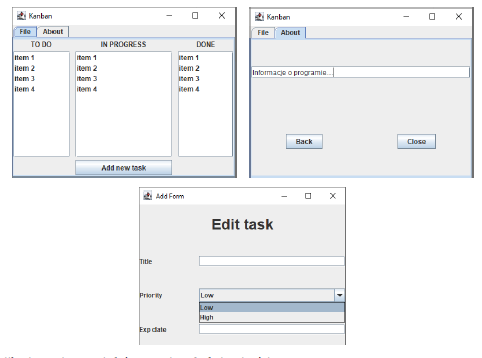
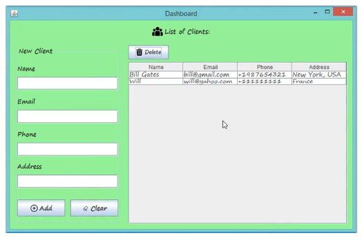

# PROGRAMOWANIE OBIEKTOWE
## GUI JAVA SWING LABORATORIUM
### JSPINNER, JSLIDER, JPROGRESSBAR, JMENUBAR, JMENU AND JMENUITEM, JTOOLBARM
### JSPINNER
```
public class JSpinner extends JComponent implements Accessible
```

Commonly used Constructors:

| Constructor                                | Description                                                                      |
|--------------------------------------------|----------------------------------------------------------------------------------|
| `JSpinner()`                               | It is used to construct a spinner with an Integer SpinnerNumberModel with initial value 0 and no minimum or maximum limits.  |
| `JSpinner(SpinnerModel model)`             | It is used to construct a spinner for a given model.                             |

Commonly used Methods:

| Methods                                     | Description                                                          |
|---------------------------------------------|----------------------------------------------------------------------|
| `void addChangeListener(ChangeListener listener)` | It is used to add a listener to the list that is notified each time a change to the model occurs. |
| `Object getValue()`                         | It is used to return the current value of the mode.                 |

### PRZYKŁAD
```java
import javax.swing.*;
import javax.swing.event.*;
public class SpinnerExample {
public static void main(String[] args) {
  JFrame f=new JFrame("Spinner Example");
  final JLabel label = new JLabel();
  label.setHorizontalAlignment(JLabel.CENTER);
  label.setSize(250,100);
  SpinnerModel value =
  new SpinnerNumberModel(5, //initial value
  0, //minimum value
  10, //maximum value
  1); //step
  JSpinner spinner = new JSpinner(value);
  spinner.setBounds(100,100,50,30);
  f.add(spinner); f.add(label);
  f.setSize(300,300);
  f.setLayout(null);
  f.setVisible(true);
  spinner.addChangeListener(new ChangeListener() {
    public void stateChanged(ChangeEvent e) {
    label.setText("Value : " +
    ((JSpinner)e.getSource()).getValue());
  }
  });
}
}
```
### JSLIDER

Commonly used Constructors:

| Constructor                                       | Description                                                                                     |
|---------------------------------------------------|-------------------------------------------------------------------------------------------------|
| `JSlider()`                                       | creates a slider with the initial value of 50 and range of 0 to 100.                            |
| `JSlider(int orientation)`                        | creates a slider with the specified orientation set by either `JSlider.HORIZONTAL` or `JSlider.VERTICAL` with the range 0 to 100 and initial value 50. |
| `JSlider(int min, int max)`                       | creates a horizontal slider using the given min and max.                                        |
| `JSlider(int min, int max, int value)`            | creates a horizontal slider using the given min, max and value.                                 |
| `JSlider(int orientation, int min, int max, int value)` | creates a slider using the given orientation, min, max and value.                          |

Commonly used Methods:

| Methods                                    | Description                                                                                     |
|--------------------------------------------|-------------------------------------------------------------------------------------------------|
| `public void setMinorTickSpacing(int n)`   | is used to set the minor tick spacing to the slider.                                            |
| `public void setMajorTickSpacing(int n)`   | is used to set the major tick spacing to the slider.                                            |
| `public void setPaintTicks(boolean b)`     | is used to determine whether tick marks are painted.                                            |
| `public void setPaintLabels(boolean b)`    | is used to determine whether labels are painted.                                                |
| `public void setPaintTracks(boolean b)`    | is used to determine whether track is painted.                                                  |

### PRZYKŁAD
```java
import javax.swing.*;
public class SliderExample extends JFrame{
  public SliderExample() {
  JSlider slider = new JSlider(JSlider.HORIZONTAL, 0, 50, 25);
  slider.setMinorTickSpacing(2);
  slider.setMajorTickSpacing(10);
  slider.setPaintTicks(true);
  slider.setPaintLabels(true);
  JPanel panel=new JPanel();
  panel.add(slider);
  add(panel);
}
  public static void main(String s[]) {
    SliderExample frame=new SliderExample();
      frame.pack();
      frame.setVisible(true);
}
```
### JPROGRESSBAR
```
public class JProgressBar extends JComponent implements SwingConstants, Accessible
```

Commonly used Constructors:

| Constructor                               | Description                                                                                                                 |
|-------------------------------------------|-----------------------------------------------------------------------------------------------------------------------------|
| `JProgressBar()`                          | It is used to create a horizontal progress bar but no string text.                                                          |
| `JProgressBar(int min, int max)`          | It is used to create a horizontal progress bar with the specified minimum and maximum value.                                 |
| `JProgressBar(int orient)`                | It is used to create a progress bar with the specified orientation, it can be either Vertical or Horizontal by using `SwingConstants.VERTICAL` and `SwingConstants.HORIZONTAL` constants. |
| `JProgressBar(int orient, int min, int max)` | It is used to create a progress bar with the specified orientation, minimum and maximum value.                               |

Commonly used Methods:

| Methods                              | Description                                                                                                              |
|--------------------------------------|--------------------------------------------------------------------------------------------------------------------------|
| `void setStringPainted(boolean b)`   | It is used to determine whether string should be displayed.                                                              |
| `void setString(String s)`           | It is used to set value to the progress string.                                                                          |
| `void setOrientation(int orientation)` | It is used to set the orientation, it may be either vertical or horizontal by using `SwingConstants.VERTICAL` and `SwingConstants.HORIZONTAL` constants. |
| `void setValue(int value)`            | It is used to set the current value on the progress bar.                                                                 |

### PRZYKŁAD
```java
import javax.swing.*;
public class ProgressBarExample extends JFrame{
  JProgressBar jb;
  int i=0,num=0;
  ProgressBarExample(){
  jb=new JProgressBar(0,2000);
  jb.setBounds(40,40,160,30);
  jb.setValue(0);
  jb.setStringPainted(true);
  add(jb);
  setSize(250,150);
  setLayout(null);
}
public void iterate(){
  while(i<=2000){
  jb.setValue(i);
  i=i+20;
  try{Thread.sleep(150);}catch(Exception e){}
  }
}
public static void main(String[] args) {
  ProgressBarExample m=new ProgressBarExample();
  m.setVisible(true);
  m.iterate();
  }
}
```

### JMENUBAR, JMENU AND JMENUITEM
```
public class JMenuBar extends JComponent implements MenuElement, Accessible
public class JMenu extends JMenuItem implements MenuElement, Accessible
public class JMenuItem extends AbstractButton implements Accessible,
MenuElement
```

### PRZYKŁAD JAVA JMENUITEM AND JMENU EXAMPLE
```java
import javax.swing.*;
class MenuExample
{
  JMenu menu, submenu;
  JMenuItem i1, i2, i3, i4, i5;
  MenuExample(){
  JFrame f= new JFrame("Menu and MenuItem Example");
  JMenuBar mb=new JMenuBar();
  menu=new JMenu("Menu");
  submenu=new JMenu("Sub Menu");
  i1=new JMenuItem("Item 1");
  i2=new JMenuItem("Item 2");
  i3=new JMenuItem("Item 3");
  i4=new JMenuItem("Item 4");
  i5=new JMenuItem("Item 5");
  menu.add(i1); menu.add(i2); menu.add(i3);
  submenu.add(i4); submenu.add(i5);
  menu.add(submenu);
  mb.add(menu);
  f.setJMenuBar(mb);
  f.setSize(400,400);
  f.setLayout(null);
  f.setVisible(true);
}
  public static void main(String args[])
  {
  new MenuExample();
  }
}
```
### JTABLE POPUP MENU EXAMPLE
```java
import javax.swing.JFrame;
import javax.swing.JMenuItem;
import javax.swing.JPopupMenu;
import javax.swing.JScrollPane;
import javax.swing.JTable;
import javax.swing.SwingUtilities;
import javax.swing.table.DefaultTableModel;
public class JTablePopupMenuExample extends JFrame implements
  ActionListener {
    private JTable table;
    private DefaultTableModel tableModel;
    private JPopupMenu popupMenu;
    private JMenuItem menuItemAdd;
    private JMenuItem menuItemRemove;
    private JMenuItem menuItemRemoveAll;
    public JTablePopupMenuExample() {
    super("JTable Popup Menu Example");
    // sample table data
    String[] columnNames = new String[] {"Title", "Author",
    "Publisher", "Published Date", "Pages", "Rating"};
    String[][] rowData = new String[][] {
    {"Effective Java", "Joshua Bloch", "Addision-Wesley", "May 08th
    2008", "346", "5"},
    {"Thinking in Java", "Bruce Eckel", "Prentice Hall", "Feb 26th
    2006", "1150", "4"},
    {"Head First Java", "Kathy Sierra & Bert Bates", "O'Reilly
    Media", "Feb 09th 2005", "688", "4.5"},};
    // constructs the table with sample data
    tableModel = new DefaultTableModel(rowData, columnNames);
    table = new JTable(tableModel);
    // constructs the popup menu
    popupMenu = new JPopupMenu();
    menuItemAdd = new JMenuItem("Add New Row");
    menuItemRemove = new JMenuItem("Remove Current Row");
    menuItemRemoveAll = new JMenuItem("Remove All Rows");
    menuItemAdd.addActionListener(this);
    menuItemRemove.addActionListener(this);
    menuItemRemoveAll.addActionListener(this);
    popupMenu.add(menuItemAdd);
    popupMenu.add(menuItemRemove);
    popupMenu.add(menuItemRemoveAll);
    // sets the popup menu for the table
    table.setComponentPopupMenu(popupMenu);
    table.addMouseListener(new TableMouseListener(table));
    // adds the table to the frame
    add(new JScrollPane(table));
    setDefaultCloseOperation(JFrame.EXIT_ON_CLOSE);
    setSize(640, 150);
    setLocationRelativeTo(null);
}
public static void main(String[] args) {
  SwingUtilities.invokeLater(new Runnable() {
  @Override
  public void run() {
    new JTablePopupMenuExample().setVisible(true);
  }
  });
}
@Override
public void actionPerformed(ActionEvent event) {
  JMenuItem menu = (JMenuItem) event.getSource();
if (menu == menuItemAdd) {
  addNewRow();
} else if (menu == menuItemRemove) {
  removeCurrentRow();
} else if (menu == menuItemRemoveAll) {
  removeAllRows();
  }
}
private void addNewRow() {
  tableModel.addRow(new String[0]);
}
private void removeCurrentRow() {
  int selectedRow = table.getSelectedRow();
  tableModel.removeRow(selectedRow);
}
private void removeAllRows() {
  int rowCount = tableModel.getRowCount();
  for (int i = 0; i < rowCount; i++) {
  tableModel.removeRow(0);
  }
  }
}
import javax.swing.JTable;
public class TableMouseListener extends MouseAdapter {
  private JTable table;
public TableMouseListener(JTable table) {
  this.table = table;
}
@Override
public void mousePressed(MouseEvent event) {
  // selects the row at which point the mouse is clicked
  Point point = event.getPoint();
  int currentRow = table.rowAtPoint(point);
  table.setRowSelectionInterval(currentRow, currentRow);
  }
}
```

### PRZYKŁAD JAVA SWING DRAG AND DROP
```java
package DnD;
import java.awt.BorderLayout;
import java.awt.Container;
import java.awt.datatransfer.DataFlavor;
import java.awt.datatransfer.StringSelection;
import java.awt.datatransfer.Transferable;
import javax.swing.Box;
import javax.swing.DefaultListModel;
import javax.swing.DropMode;
import javax.swing.JComponent;
import javax.swing.JFrame;
import javax.swing.JLabel;
import javax.swing.JList;
import javax.swing.JScrollPane;
import javax.swing.JTextField;
import javax.swing.ListSelectionModel;
import javax.swing.SwingUtilities;
import javax.swing.TransferHandler;

public class Main extends JFrame {
  private JTextField newTextField = new JTextField(10);
  private JList<String> sourceList = new JList<>(new
  DefaultListModel<>());
  private JList<String> destList = new JList<>(new DefaultListModel<>());
  public Main() {
    for (int i = 0; i < 15; i++) {
    ((DefaultListModel<String>) sourceList.getModel()).add(i, "A "
    + i);
    ((DefaultListModel<String>) destList.getModel()).add(i, "B " +
    i);
    }
    Box nameBox = Box.createHorizontalBox();
    nameBox.add(new JLabel("New:"));
    nameBox.add(newTextField);
    Box sourceBox = Box.createVerticalBox();
    sourceBox.add(new JLabel("Source"));
    sourceBox.add(new JScrollPane(sourceList));
    Box destBox = Box.createVerticalBox();
    destBox.add(new JLabel("Destination"));
    destBox.add(new JScrollPane(destList));
    Box listBox = Box.createHorizontalBox();
    listBox.add(sourceBox);
    listBox.add(destBox);
    Box allBox = Box.createVerticalBox();
    allBox.add(nameBox);
    allBox.add(listBox);
    this.getContentPane().add(allBox, BorderLayout.CENTER);
    sourceList.setSelectionMode(ListSelectionModel.SINGLE_SELECTION);
    destList.setSelectionMode(ListSelectionModel.SINGLE_SELECTION);
    newTextField.setDragEnabled(true);
    sourceList.setDragEnabled(true);
    destList.setDragEnabled(true);
    sourceList.setDropMode(DropMode.INSERT);
    destList.setDropMode(DropMode.INSERT);
    sourceList.setTransferHandler(new ListTransferHandler());
    destList.setTransferHandler(new ListTransferHandler());
  }
    public static void main(String[] args) {
    SwingUtilities.invokeLater(() -> {
      Main frame = new Main();
      frame.pack();
      frame.setVisible(true);
    });
  }
  }
    class ListTransferHandler extends TransferHandler {
    @Override
      public int getSourceActions(JComponent c) {
      return TransferHandler.COPY_OR_MOVE;
  }
    @Override
    protected Transferable createTransferable(JComponent source) {
      JList<String> sourceList = (JList<String>) source;
      String data = sourceList.getSelectedValue();
      Transferable t = new StringSelection(data);
      return t;
    }
    @Override
    protected void exportDone(JComponent source, Transferable data, int
    action) {
      @SuppressWarnings("unchecked")
      JList<String> sourceList = (JList<String>) source;
      String movedItem = sourceList.getSelectedValue();
      if (action == TransferHandler.MOVE) {
      DefaultListModel<String> listModel = (DefaultListModel<String>)
      sourceList
      .getModel();
      listModel.removeElement(movedItem);
      }
    }
    @Override
    public boolean canImport(TransferHandler.TransferSupport support) {
      if (!support.isDrop()) {
        return false;
    }
      return support.isDataFlavorSupported(DataFlavor.stringFlavor);
    }
    @Override
    public boolean importData(TransferHandler.TransferSupport support) {
      if (!this.canImport(support)) {
        return false;
    }
    Transferable t = support.getTransferable();
    String data = null;
    try {
    data = (String) t.getTransferData(DataFlavor.stringFlavor);
      if (data == null) {
        return false;
    }
    } catch (Exception e) {
    e.printStackTrace();
      return false;
    }
    JList.DropLocation dropLocation = (JList.DropLocation) support
    .getDropLocation();
    int dropIndex = dropLocation.getIndex();
    JList<String> targetList = (JList<String>) support.getComponent();
    DefaultListModel<String> listModel = (DefaultListModel<String>)
    targetList
    .getModel();
    if (dropLocation.isInsert()) {
    listModel.add(dropIndex, data);
    } else {
    listModel.set(dropIndex, data);
    }
      return true;
    }
}
```

### Zadania do samodzielnego rozwiązania
### Zadanie 1.
Stwórz aplikację do zarządzania projektami w oparciu o metodę Kanban, opis metody możesz znaleźć
pod adresem: [link](https://pl.wikipedia.org/wiki/Tablica_kanban) , [link](https://kanbantool.com/pl/tablica-kanban)

Mockup aplikacji: Przedstawiony poniżej mockup należy traktować poglądowo. Jego celem jest
ilustracja elementów, które są wymagane w aplikacji. Natomiast konkretne komponenty Java powinny
zostać wybrane wedle własnego uznania.

<br>

Aplikacja powinna posiadać następujące funkcjonalności:

• Dodawanie nowego zadania przy użyciu formularza, który wyświetla się po wciśnięciu
przycisku "Add new task". Formularz pozwala na wprowadzenie takich informacji jak: tytuł,
opis, priorytet, termin ważności (wykorzystaj JDateChooser).

• Nowe zadanie domyślnie pokazuje się na liście "TODO"

• Po najechaniu na element z listy powinien się wyświetlić Tooltip zawierający opis zadania
(należy wykorzystać metodę setToolTipText()).

• Po kliknięciu prawym przyciskiem myszy na element z listy powinno się wyświetlić Menu z
dwoma opcjami:

  o Delete (usuwa element)

  o Edit (wyświetla formularz do edycji zadania).
(Wskazówka należy użyć popup menu – tworzenie patrz przykład w materiałach.)

• Możliwe jest przenoszenie zadań między listami – implementacja dowolna (dedykowany
przycisk lub drag-and-drop (przeanalizuj przykład użycia DaD)

• Zadbaj o czytelność i ergonomię aplikacji.

### Zadanie 2
Stwórz aplikację do zarządzania bazą klientów. Poniżej przedstawiono widoki jakie powinna zawierać
aplikacja (nie musisz trzymać się 1:1 widoku).

<br>

Aplikacja powinna posiadać następujące funkcjonalności:

• Dodawane klienta poprzez odpowiednie pola wraz z walidacją – wszystkie pola muszą być
uzupełnione.

• Przycisk Clear czyści pola

• Add – sprawdza czy pola są uzupełnione i dodaje klienta do bazy.

• Po zaznaczeniu klienta w tabeli i kliknięciu Delete usuwamy zaznaczony rekord.
